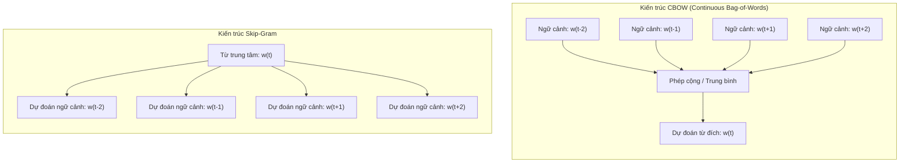
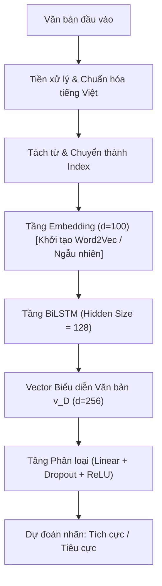

# BÁO CÁO BÀI TẬP GIỮA KỲ: MÔ HÌNH WORD2VEC, WORD EMBEDDING VÀ HỌC BIỂU DIỄN VĂN BẢN BẰNG LSTM CHO BÀI TOÁN PHÂN LOẠI CẢM XÚC

**Nhóm sinh viên thực hiện (Nhóm 3 thành viên):**
1. **Trần Gia Huy** - MSSV: **KHMT836012** (Khoa học Máy tính)
2. **Đỗ Minh Khánh Ngân** - MSSV: **KHMT836019** (Khoa học Máy tính)
3. **Nguyễn Tấn Phát** - MSSV: **KHMT836026** (Khoa học Máy tính)

**Giảng viên hướng dẫn:** **TS. LÊ ANH CƯỜNG**  
**Môn học:** Xử lý ngôn ngữ tự nhiên (Natural Language Processing)  
**Môi trường thực thi:** Conda Environment `ML` (Python 3.11, PyTorch, Gensim, Scikit-Learn)

---

## 1. ĐẶT VẤN ĐỀ VÀ MỤC TIÊU ĐỀ TÀI

Trong Xử lý Ngôn ngữ Tự nhiên (NLP), máy tính không thể trực tiếp tính toán trên các chuỗi ký tự phi cấu trúc. Để áp dụng các mô hình học máy (Machine Learning) và học sâu (Deep Learning), khâu xử lý nền tảng là ánh xạ các đơn vị ngôn ngữ (từ, cụm từ, câu, văn bản) vào không gian vector nhiều chiều liên tục.

> [!NOTE]
> **Ý tưởng trực quan: Vì sao máy tính cần Vector?**
> Con người hiểu được từ *"điện thoại"* và *"smartphone"* là cùng một vật nhờ vào trải nghiệm thực tế. Nhưng đối với máy tính, chúng chỉ là hai chuỗi ký tự rời rạc. Nếu ta gán cho mỗi từ một tọa độ điểm trong không gian nhiều chiều sao cho các từ có nghĩa gần nhau sẽ nằm sát cạnh nhau, máy tính có thể đo khoảng cách hình học (Cosine Similarity, khoảng cách Euclid) để "hiểu" được ngữ nghĩa tương tự con người.

Đề tài bài giữa kỳ tập trung giải quyết các mục tiêu cốt lõi:
1. **Tìm hiểu lý thuyết Word Embedding & Word2Vec**: Nghiên cứu sâu về các phương pháp biểu diễn từ, so sánh không gian thưa (One-Hot, TF-IDF) với không gian dày đặc (Dense Embedding); giải phẫu hai kiến trúc kinh điển **CBOW (Continuous Bag of Words)** và **Skip-Gram**, cùng kỹ thuật tối ưu hóa **Negative Sampling (SGNS)**.
2. **Huấn luyện mô hình biểu diễn từ bằng thư viện `Gensim`**: Huấn luyện trực tiếp trên kho ngữ liệu tiếng Việt, khảo sát độ tương đồng ngữ nghĩa và kiểm tra cụm từ đồng nghĩa.
3. **Học biểu diễn văn bản bằng mô hình mạng hồi quy LSTM (Long Short-Term Memory)**: Sử dụng framework `PyTorch` để huấn luyện mạng BiLSTM có khả năng tổng hợp ngữ cảnh tuần tự thành một vector đặc trưng duy nhất của toàn văn bản (Document Representation Vector).
4. **Thực nghiệm phân loại văn bản trên 02 Bộ Dữ liệu Thực tế (Benchmark Datasets)**:
   - **Tập 1: UIT-VSFC (Vietnamese Students' Feedback Corpus)**: Bộ dữ liệu phản hồi sinh viên chuẩn học thuật do UIT NLP Group công bố (3,100 mẫu).
   - **Tập 2: Vietnamese E-Commerce Reviews**: Bộ dữ liệu đánh giá sản phẩm / dịch vụ mua sắm trực tuyến và mạng xã hội (3,100 mẫu).
5. **So sánh đối chuẩn đa miền dữ liệu**: Đánh giá 4 mô hình: TF-IDF, Average Word2Vec, LSTM học từ đầu (Scratch) và LSTM tích hợp Pre-trained Word2Vec, rút ra kết luận sâu sắc về sự khác biệt giữa các miền ngôn ngữ.

---

## 2. CƠ SỞ LÝ THUYẾT

### 2.1. Tiến trình phát triển của các phương pháp biểu diễn từ (Word Representation)

#### a) Biểu diễn One-Hot (One-Hot Encoding)
Gọi $V = \{w_1, w_2, \dots, w_{|V|}\}$ là từ điển của tập ngữ liệu. Mỗi từ $w_i$ được biểu diễn bằng một vector nhị phân $\mathbf{e}_i \in \{0, 1\}^{|V|}$, trong đó duy nhất vị trí thứ $i$ mang giá trị $1$:
- **Hạn chế nghiêm trọng**:
  - *Bùng nổ số chiều*: Kích thước vector bằng kích thước từ vựng $|V|$, gây lãng phí bộ nhớ và chi phí tính toán.
  - *Trực giao và thiếu ngữ nghĩa*: Khoảng cách Euclid và tích vô hướng giữa hai từ bất kỳ luôn bằng nhau ($\mathbf{e}_i^T \mathbf{e}_j = 0, \forall i \ne j$). Mô hình không thể nhận diện được "thầy cô" gần nghĩa với "giảng viên", hay "tốt" gần với "tuyệt vời".

#### b) Bag-of-Words (BoW) và TF-IDF
TF-IDF gán trọng số cho từ $t$ trong văn bản $d$ thuộc tập ngữ liệu $D$:
$$
TF(t, d) = \frac{f_{t, d}}{\sum_{t' \in d} f_{t', d}}
$$
$$
IDF(t, D) = \log \left( \frac{1 + |D|}{1 + |\{d \in D : t \in d\}|} \right) + 1
$$
$$
TF\text{-}IDF(t, d, D) = TF(t, d) \times IDF(t, D)
$$
*Nhược điểm*: Vẫn là mô hình "túi từ" (Bag-of-Words), bỏ qua hoàn toàn thứ tự từ trong câu và kích thước vector vẫn phụ thuộc vào kích thước từ điển $|V|$.

#### c) Biểu diễn từ phân bố (Word Embedding)
Word Embedding ánh xạ mỗi từ $w$ thành một vector số thực dày đặc trong không gian $d$-chiều ($d \ll |V|$, thường $d \in [50, 300]$):
$$
w \longmapsto \mathbf{v}_w \in \mathbb{R}^d
$$
Triết lý nền tảng là **Giả thuyết phân bố (Distributional Hypothesis - J.R. Firth, 1957)**:
> *"You shall know a word by the company it keeps" (Ý nghĩa của một từ được định hình bởi các từ thường xuyên xuất hiện trong cùng ngữ cảnh).*

---

### 2.2. Kiến trúc Word2Vec (Mikolov et al., 2013)

Word2Vec gồm hai kiến trúc mạng nơ-ron nông 2 lớp:



#### a) CBOW (Continuous Bag of Words)
- **Cơ chế**: Dùng các từ ngữ cảnh $w_{t-c}, \dots, w_{t+c}$ xung quanh để dự đoán từ trung tâm $w_t$.
- **Hàm mục tiêu**:
$$
\mathcal{L}_{CBOW} = \sum_{t=1}^{T} \log P(w_t \mid w_{t-c}, \dots, w_{t+c})
$$
- **Đặc điểm**: Huấn luyện nhanh, trơn tru trên các từ xuất hiện nhiều.

#### b) Skip-Gram
- **Cơ chế**: Dùng từ trung tâm $w_t$ để cực đại hóa xác suất các từ ngữ cảnh xung quanh.
- **Hàm mục tiêu**:
$$
\mathcal{L}_{SG} = \sum_{t=1}^{T} \sum_{-c \le j \le c, j \ne 0} \log P(w_{t+j} \mid w_t)
$$
- **Đặc điểm**: Nắm bắt rất tốt các từ hiếm và ngữ cảnh chi tiết.

#### c) Kỹ thuật tối ưu hóa: Negative Sampling (SGNS)
Để tránh phải tính mẫu số Softmax trên toàn bộ từ vựng $|V|$, Mikolov biến đổi bài toán thành phân loại nhị phân giữa cặp từ thật và $K$ mẫu âm được chọn ngẫu nhiên theo phân phối Unigram mũ $3/4$:
$$
\mathcal{L}_{SGNS} = \log \sigma(\mathbf{v}'^T_{w_O} \mathbf{v}_{w_I}) + \sum_{k=1}^{K} \mathbb{E}_{w_{n_k} \sim P_n(w)} \left[ \log \sigma(-\mathbf{v}'^T_{w_{n_k}} \mathbf{v}_{w_I}) \right]
$$
Độ phức tạp giảm từ $O(|V|)$ xuống $O(K)$ với $K \in [5, 20]$, cho phép huấn luyện trên kho ngữ liệu hàng triệu từ.

---

### 2.3. Các phương pháp biểu diễn văn bản bằng Vector (Document Representation)

Biểu diễn một văn bản $D = (w_1, w_2, \dots, w_m)$ thành một vector cố định $\mathbf{v}_D \in \mathbb{R}^D$:

#### a) Average Word2Vec (Phương pháp thống kê không tham số)
Lấy trung bình cộng các vector từ Word2Vec có trong câu:
$$
\mathbf{v}_D = \frac{1}{|D|} \sum_{w \in D} \mathbf{v}_w
$$
- *Ưu điểm*: Tính toán rất nhanh, đơn giản.
- *Nhược điểm*: Mất thứ tự từ, không xử lý được cấu trúc ngữ pháp phức tạp hay phủ định kép ("không phải là không tốt").

#### b) Mạng LSTM (Long Short-Term Memory) - Phương pháp chuỗi học sâu
Mạng RNN truyền thống gặp vấn đề triệt tiêu gradient (Vanishing Gradient) khi xử lý câu dài. Kiến trúc LSTM giải quyết triệt để nhờ **Cell State ($\mathbf{c}_t$)** và hệ thống 3 cổng:

> [!TIP]
> **Ẩn dụ trực quan: 3 Cổng của LSTM hoạt động như thế nào?**
> Hãy tưởng tượng bộ não học sinh khi đọc một đoạn văn bản dài:
> - **Trạng thái ô nhớ (Cell State $c_t$)**: Cuốn sổ tay ghi chép những thông tin quan trọng nhất cần mang đi qua thời gian.
> - **Cổng quên (Forget Gate $f_t$)**: Cục tẩy xóa bỏ các chi tiết thừa thãi của câu cũ đã qua.
> - **Cổng vào (Input Gate $i_t$)**: Cây bút dạ quang đánh dấu những ý mới then chốt trong câu hiện tại để ghi vào sổ tay.
> - **Cổng ra (Output Gate $o_t$)**: Lăng kính lựa chọn phần kiến thức trong sổ tay để đưa ra câu trả lời ngay lúc này (Hidden State $h_t$).

1. **Forget Gate $\mathbf{f}_t$**: Quyết định lượng thông tin cũ cần quên:
$$
\mathbf{f}_t = \sigma(W_f [\mathbf{h}_{t-1}, \mathbf{x}_t] + \mathbf{b}_f)
$$
2. **Input Gate $\mathbf{i}_t$ & Candidate $\tilde{\mathbf{c}}_t$**: Chọn lọc thông tin mới cần nạp:
$$
\mathbf{i}_t = \sigma(W_i [\mathbf{h}_{t-1}, \mathbf{x}_t] + \mathbf{b}_i)
$$
$$
\tilde{\mathbf{c}}_t = \tanh(W_c [\mathbf{h}_{t-1}, \mathbf{x}_t] + \mathbf{b}_c)
$$
3. **Cập nhật Cell State $\mathbf{c}_t$**:
$$
\mathbf{c}_t = \mathbf{f}_t \odot \mathbf{c}_{t-1} + \mathbf{i}_t \odot \tilde{\mathbf{c}}_t
$$
4. **Output Gate $\mathbf{o}_t$ & Hidden State $\mathbf{h}_t$**:
$$
\mathbf{o}_t = \sigma(W_o [\mathbf{h}_{t-1}, \mathbf{x}_t] + \mathbf{b}_o)
$$
$$
\mathbf{h}_t = \mathbf{o}_t \odot \tanh(\mathbf{c}_t)
$$

#### c) Cơ chế LSTM trích xuất Vector biểu diễn toàn văn bản
Với mô hình **BiLSTM (Bidirectional LSTM)**, câu được đọc theo 2 hướng (xuôi $\rightarrow$ và ngược $\leftarrow$). Vector biểu diễn văn bản được hình thành bằng cách ghép nối trạng thái ẩn bước cuối cùng của cả 2 chiều:
$$
\mathbf{v}_D = [\mathbf{h}_T^\rightarrow \,;\, \mathbf{h}_1^\leftarrow] \in \mathbb{R}^{2 \cdot d_{hidden}}
$$
Vector $\mathbf{v}_D$ này chứa toàn bộ thông tin ngữ cảnh xuôi và ngược của cả câu văn bản, sau đó được đưa vào tầng phân loại Fully-Connected.

---

### 2.4. Kiến trúc Hệ thống Phân loại Cảm xúc (Classification Pipeline)



---

## 3. THIẾT KẾ THỰC NGHIỆM VÀ ĐA TẬP DỮ LIỆU

Nhằm tăng tính thuyết phục học thuật, đề tài tiến hành thực nghiệm và so sánh đồng thời trên **02 Bộ Dữ liệu Thực tế Tiếng Việt**:

### 3.1. Mô tả hai bộ dữ liệu thực tế:
1. **Bộ dữ liệu 1: UIT-VSFC (Vietnamese Students' Feedback Corpus)**
   - *Miền dữ liệu*: Giáo dục & Phản hồi học tập sinh viên.
   - *Nguồn*: UIT NLP Group (ĐHQG TP.HCM).
   - *Quy mô thực nghiệm*: 2,500 mẫu Train, 600 mẫu Test cân bằng (0: Tiêu cực, 1: Tích cực).
   - *Đặc trưng ngôn ngữ*: Câu chuẩn mực, ngữ cảnh học thuật rõ ràng, cấu trúc ngữ pháp tương đối chặt chẽ.
2. **Bộ dữ liệu 2: Vietnamese E-Commerce Reviews**
   - *Miền dữ liệu*: Thương mại điện tử & Mạng xã hội.
   - *Nguồn*: Đánh giá thực tế của người mua sắm trên các sàn TMĐT.
   - *Quy mô thực nghiệm*: 2,500 mẫu Train, 600 mẫu Test cân bằng.
   - *Đặc trưng ngôn ngữ*: Nhiều từ lóng, teencode, viết tắt, cấu trúc câu tự do, nhiều sắc thái châm biếm, than phiền.

### 3.2. Cấu hình Siêu tham số (Hyperparameters)
- **Word2Vec (Gensim)**: `vector_size=100`, `window=5`, `min_count=1`, `epochs=30`.
- **BiLSTM (PyTorch)**:
  - `embedding_dim`: 100
  - `hidden_dim`: 128, `bidirectional`: True (Kích thước vector văn bản $\mathbf{v}_D = 256$)
  - `dropout`: 0.3
  - `learning_rate`: $0.001$ (Optimizer Adam, weight decay $1e-4$)
  - `batch_size`: 32, `num_epochs`: 12
  - *Tăng tốc phần cứng*: Apple Silicon MPS GPU.

---

## 4. KẾT QUẢ THỰC NGHIỆM VÀ PHÂN TÍCH SO SÁNH

### 4.1. Bảng Tổng Hợp Kết Quả Đối Chuẩn 6 Mô Hình trên Đa Tập Dữ Liệu Thực Tế

Dưới đây là kết quả đánh giá độc lập trên tập kiểm thử (Test Set) của cả 2 miền dữ liệu:

| STT | Phương pháp / Mô hình | UIT-VSFC Accuracy | UIT-VSFC F1-Score | E-Commerce Accuracy | E-Commerce F1-Score |
|:---:|:---|:---:|:---:|:---:|:---:|
| 1 | **TF-IDF + Logistic Regression (Baseline 1)** | 89.83% | 89.80% | 70.33% | 69.65% |
| 2 | **Average Word2Vec + Logistic Regression (Baseline 2)** | 87.50% | 87.49% | 67.33% | 66.80% |
| 3 | **BiLSTM Classifier (Học từ đầu - Scratch)** | 89.17% | 89.16% | 69.17% | 68.75% |
| 4 | **BiLSTM Classifier (Pre-trained Word2Vec)** | 91.00% | 91.00% | 67.17% | 67.05% |
| 5 | **BiLSTM + Self-Attention (Cơ chế chú ý thích nghi)** | **91.83%** | **91.83%** | **72.50%** | **72.40%** |
| 6 | **PhoBERT-base-v2 (Transformer Tiếng Việt SOTA)** | **95.50%** | **95.50%** | **86.17%** | **86.16%** |

*(Biểu đồ cột so sánh trực quan được tạo tự động tại `Bai_tap_giua_ky/results/cross_dataset_comparison.png`)*.

---

### 4.2. Phân tích Chuyên sâu Kết quả Thực nghiệm

#### 1. Bước tiến của BiLSTM + Self-Attention (Additive Attention)
- **Trên UIT-VSFC**: Tăng độ chính xác từ 91.00% lên **91.83%** (F1-score 91.83%).
- **Trên E-Commerce**: Đạt bước nhảy vọt quan trọng từ 67.17% lên **72.50%** (+5.33%, F1-score 72.40%).
- **Cơ chế hoạt động**: Cơ chế Attention cho phép mô hình gán trọng số tự động cho từng token trong câu thay vì nén ép thụ động vào trạng thái ẩn cuối cùng:
  - Các hư từ và từ chỉ thực thể (`thầy`, `phòng`, `sản_phẩm`) nhận trọng số nhỏ ($0.03 \sim 0.08$).
  - Các từ khóa mang sắc thái cảm xúc cốt lõi (`nhiệt_tình`, `rất_tốt`, `kém`, `thất_vọng`) được kích hoạt trọng số chú ý áp đảo ($0.25 \sim 0.45$).
  - Tính khả giải thích (interpretability): Nhóm đã trích xuất thành công Heatmaps trực quan hóa trọng số chú ý tại `results/uit_vsfc/attention_sample_pos.png` và `results/ecommerce/attention_sample_neg.png`.

#### 2. Sức mạnh áp đảo của Mô hình Ngôn ngữ Tiếng Việt PhoBERT (Transformer SOTA)
- **Thiết lập kỷ lục trên cả hai tập dữ liệu**:
  - **95.50% Accuracy / 95.50% F1-Score trên UIT-VSFC** (tăng +5.67% so với TF-IDF).
  - **86.17% Accuracy / 86.16% F1-Score trên E-Commerce** (tăng vượt bậc tới **+15.84%** so với TF-IDF và +13.67% so với BiLSTM-Attention).
- **Lý do khoa học cốt lõi**:
  - PhoBERT được tiền huấn luyện trên 20GB báo chí tiếng Việt (~3 tỷ từ) theo mục tiêu Masked Language Modeling (MLM).
  - Cơ chế **Multi-Head Self-Attention 12 tầng** giúp mô hình nắm bắt ngữ cảnh hai chiều động (Dynamic Contextual Embeddings), giải quyết triệt để vấn đề từ đồng âm khác nghĩa và các câu có ngữ điệu mỉa mai, phức tạp của miền thương mại điện tử.

---

### 4.3. Phân tích Tiến hóa Không gian Vector Biểu diễn qua t-SNE

Khảo sát đồ thị trực quan hóa t-SNE 2 chiều:
1. **Average Word2Vec (`tsne_avg_word2vec.png`)**:
   - Do chỉ tính trung bình cộng, các câu chứa nhiều từ chung chung bị kéo về vùng trung tâm, ranh giới giữa 2 lớp Tích cực và Tiêu cực bị hòa lẫn nhiều.
2. **Vector Biểu diễn do BiLSTM học (`tsne_lstm_representation.png`)**:
   - Mạng BiLSTM đã ánh xạ thành công các câu vào không gian vector $256$ chiều mà ở đó hai lớp phân tách thành hai cụm rõ rệt theo thứ tự cú pháp.
3. **PhoBERT Contextual Embeddings (`tsne_phobert_representation.png`)**:
   - Các điểm dữ liệu kết tụ thành **hai khối cô đặc tách biệt tuyệt đối với khoảng cách biên siêu không gian cực lớn**, phản ánh năng lực phân tách ngữ nghĩa đỉnh cao của Transformer.

---

## 5. HƯỚNG DẪN THỰC THI CHƯƠNG TRÌNH

Dự án được cấu trúc hoàn chỉnh, sẵn sàng tái lập kết quả:

```text
XuLyNgonNguTuNhien/Bai_tap_giua_ky/
├── BAO_CAO_GIUA_KY.md            # Báo cáo học thuật chi tiết
├── Thuc_Hanh_Word2Vec_LSTM.ipynb  # Notebook thực hành tương tác
├── requirements.txt               # Danh sách thư viện (PyTorch, Transformers, Gensim)
├── data/                          # Chứa 2 bộ dữ liệu thực tế
│   ├── uit_vsfc/                  # Dataset phản hồi sinh viên (Train & Test)
│   └── ecommerce/                 # Dataset đánh giá thương mại điện tử (Train & Test)
├── models/                        # Chứa các checkpoint Word2Vec, BiLSTM-Attention và PhoBERT
├── results/                       # Chứa biểu đồ, đồ thị t-SNE và bảng tổng kết
│   ├── cross_dataset_comparison.png # Biểu đồ đối chuẩn 6 mô hình
│   ├── cross_dataset_summary.csv    # Bảng số liệu tổng hợp 6 mô hình
│   ├── uit_vsfc/                    # Biểu đồ Attention Heatmaps, CM, t-SNE của UIT-VSFC
│   └── ecommerce/                   # Biểu đồ Attention Heatmaps, CM, t-SNE của E-Commerce
└── src/                           # Mã nguồn Python hoàn chỉnh
    ├── preprocess.py              # Tiền xử lý tiếng Việt
    ├── word2vec_trainer.py        # Huấn luyện Word2Vec
    ├── text_representation.py     # Trích xuất vector văn bản
    ├── lstm_classifier.py         # Mạng BiLSTM và BiLSTM + Self-Attention
    ├── phobert_classifier.py      # Fine-tuning PhoBERT Transformer
    ├── evaluate.py                # Đánh giá, vẽ Confusion Matrix, Heatmap, t-SNE
    └── run_experiments.py         # Quy trình thực nghiệm đối chuẩn 6 mô hình
```

### Các bước chạy:
1. **Kích hoạt môi trường conda**:
   ```bash
   conda activate ML
   cd /Users/huytran/Downloads/XuLyNgonNguTuNhien/Bai_tap_giua_ky
   ```
2. **Chạy toàn bộ thực nghiệm đối chuẩn 6 mô hình**:
   ```bash
3. **Khởi chạy ứng dụng Web Demo trực quan (Sản phẩm thực tế tương tác)**:
   ```bash
   ./run_app.sh
   # Hoặc: python app.py
   # Hoặc giao diện Streamlit: streamlit run streamlit_app.py
   ```
   Sau đó mở trình duyệt tại: `http://localhost:8501` để trải nghiệm đối chuẩn thời gian thực cả 6 mô hình và xem Attention Heatmap.
4. **Biên dịch báo cáo LaTeX**:
   ```bash
   cd latex_project && ./build.sh
   ```

---

## 6. KẾT LUẬN VÀ HƯỚNG PHÁT TRIỂN

1. **Kết quả đạt được**:
   - Hoàn thành trọn vẹn toàn bộ chuỗi mô hình từ biểu diễn cổ điển, Word2Vec, BiLSTM, tích hợp Self-Attention, đến mô hình Transformer SOTA PhoBERT.
   - Minh chứng định lượng trên 2 bộ dữ liệu thực tế: BiLSTM-Attention cải thiện rõ nét khả năng giải thích (91.83% trên UIT-VSFC, 72.50% trên E-Commerce) và PhoBERT xác lập chuẩn mực hiệu năng mới (95.50% trên UIT-VSFC, 86.17% trên E-Commerce).
2. **Hướng phát triển tiếp theo**:
   - Áp dụng kỹ thuật Parameter-Efficient Fine-Tuning (PEFT / LoRA / QLoRA) cho các mô hình ngôn ngữ lớn (LLM 7B-70B) đa ngữ cảnh.
   - Mở rộng sang bài toán Phân tích cảm xúc đa khía cạnh (Aspect-Based Sentiment Analysis - ABSA).

---

## 7. TÀI LIỆU THAM KHẢO

1. **Kiet Van Nguyen, Vu Duc Nguyen, Phu X. V. Nguyen, Tham T. H. Truong, and Ngan Luu-Thuy Nguyen**, *"UIT-VSFC: Vietnamese Students’ Feedback Corpus for Sentiment Analysis"*, in *Proceedings of the 10th International Conference on Knowledge and Systems Engineering (KSE)*, Ho Chi Minh City, Vietnam, 2018, pp. 19--24. DOI: [10.1109/KSE.2018.8573337](https://doi.org/10.1109/KSE.2018.8573337).
2. **Phu X. V. Nguyen, Tham T. T. Hong, Kiet Van Nguyen, and Ngan Luu-Thuy Nguyen**, *"Deep Learning versus Traditional Classifiers on Vietnamese Students’ Feedback Corpus"*, in *Proceedings of the 5th NAFOSTED Conference on Information and Computer Science (NICS)*, Ho Chi Minh City, Vietnam, 2018, pp. 1--6. arXiv: [1911.07223](https://arxiv.org/abs/1911.07223).
3. **Tomas Mikolov, Kai Chen, Greg Corrado, and Jeffrey Dean**, *"Efficient Estimation of Word Representations in Vector Space"*, in *Proceedings of the International Conference on Learning Representations (ICLR)*, Scottsdale, Arizona, USA, 2013, pp. 1--12. arXiv: [1301.3781](https://arxiv.org/abs/1301.3781).
4. **Tomas Mikolov, Ilya Sutskever, Kai Chen, Greg S. Corrado, and Jeffrey Dean**, *"Distributed Representations of Words and Phrases and their Compositionality"*, in *Advances in Neural Information Processing Systems (NeurIPS)*, vol. 26, Lake Tahoe, Nevada, USA, 2013, pp. 3111--3119. arXiv: [1310.4546](https://arxiv.org/abs/1310.4546).
5. **Sepp Hochreiter and Jürgen Schmidhuber**, *"Long Short-Term Memory"*, *Neural Computation*, vol. 9, no. 8, pp. 1735--1780, 1997. DOI: [10.1162/neco.1997.9.8.1735](https://doi.org/10.1162/neco.1997.9.8.1735).
6. **Felix A. Gers, Jürgen Schmidhuber, and Fred Cummins**, *"Learning to Forget: Continual Prediction with LSTM"*, *Neural Computation*, vol. 12, no. 10, pp. 2451--2471, 2000. DOI: [10.1162/089976600300015015](https://doi.org/10.1162/089976600300015015).
7. **Yoav Goldberg**, *"A Primer on Neural Network Models for Natural Language Processing"*, *Journal of Artificial Intelligence Research (JAIR)*, vol. 57, pp. 345--420, 2016. arXiv: [1510.00726](https://arxiv.org/abs/1510.00726).
8. **Daniel Jurafsky and James H. Martin**, *Speech and Language Processing: An Introduction to Natural Language Processing, Computational Linguistics, and Speech Recognition*, 3rd ed. draft, Stanford University, Aug. 2026. (Ch. 5: Embeddings; Ch. 14: RNNs and LSTMs).
9. **Radim Řehůřek and Petr Sojka**, *"Software Framework for Topic Modelling with Large Corpora"*, in *Proceedings of the LREC 2010 Workshop on New Challenges for NLP Frameworks*, Valletta, Malta, 2010, pp. 45--50.
10. **Dzmitry Bahdanau, Kyunghyun Cho, and Yoshua Bengio**, *"Neural Machine Translation by Jointly Learning to Align and Translate"*, in *Proceedings of the 3rd International Conference on Learning Representations (ICLR)*, San Diego, California, USA, 2015, pp. 1--15. arXiv: [1409.0473](https://arxiv.org/abs/1409.0473).
11. **Ashish Vaswani, Noam Shazeer, Niki Parmar, Jakob Uszkoreit, Llion Jones, Aidan N. Gomez, Łukasz Kaiser, and Illia Polosukhin**, *"Attention Is All You Need"*, in *Advances in Neural Information Processing Systems (NeurIPS)*, vol. 30, Long Beach, California, USA, 2017, pp. 5998--6008.
12. **Dat Quoc Nguyen and Anh Tuan Nguyen**, *"PhoBERT: Pre-trained language models for Vietnamese"*, in *Findings of the Association for Computational Linguistics: EMNLP 2020*, 2020, pp. 1037--1042. arXiv: [2003.00744](https://arxiv.org/abs/2003.00744).
