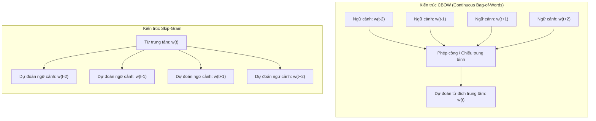
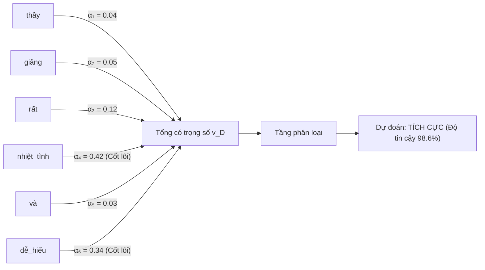
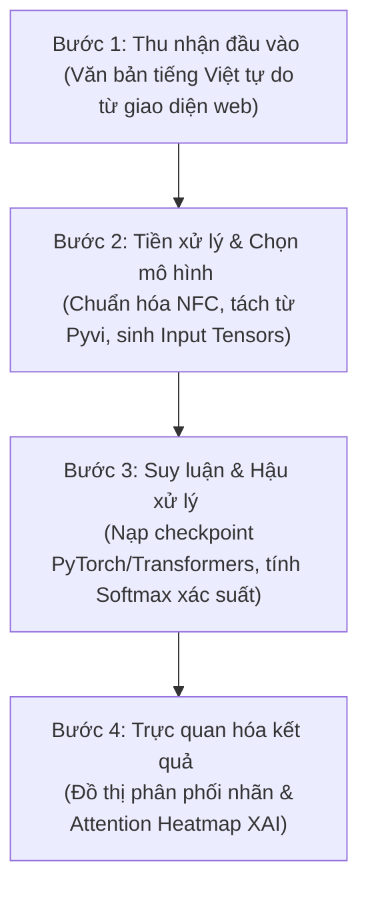

# BÁO CÁO TIỂU LUẬN GIỮA KỲ: MÔ HÌNH WORD2VEC, WORD EMBEDDING VÀ HỌC BIỂU DIỄN VĂN BẢN BẰNG LSTM CHO BÀI TOÁN PHÂN LOẠI CẢM XÚC

**Đơn vị đào tạo:** Trường Đại học Sư phạm Thành phố Hồ Chí Minh (HCMUE) — Khoa Khoa học Máy tính  
**Học phần:** Xử lý ngôn ngữ tự nhiên (Natural Language Processing)  
**Lớp:** Cao học Khoa học Máy tính — Khóa 36 (2025 – 2027)  
**Giảng viên hướng dẫn:** **PGS.TS. LÊ ANH CƯỜNG**  

**Nhóm học viên thực hiện (Nhóm 3 thành viên):**
1. **Trần Gia Huy** — MSSV: **KHMT836012**
2. **Đỗ Minh Khánh Ngân** — MSSV: **KHMT836019**
3. **Nguyễn Tấn Phát** — MSSV: **KHMT836026**

**Môi trường thực thi chuẩn:** Python 3.11, Conda Environment `ML`, PyTorch 2.x, Hugging Face Transformers, Gensim, Scikit-learn, Pyvi.  
**Live Interactive Dashboard:** [https://trangiahuy8444.github.io/NLP/](https://trangiahuy8444.github.io/NLP/)

---

## MỤC LỤC TỔNG QUAN

- [1. Đặt Vấn Đề và Mục Tiêu Nghiên Cứu](#1-đặt-vấn-đề-và-mục-tiêu-nghiên-cứu)
- [2. Cơ Sở Lý Luận](#2-cơ-sở-lý-luận)
  - [2.1. Tiến trình phát triển biểu diễn từ trong NLP](#21-tiến-trình-phát-triển-biểu-diễn-từ-trong-nlp)
  - [2.2. Không gian vector phân bố Word2Vec](#22-không-gian-vector-phân-bố-word2vec)
  - [2.3. Các phương pháp biểu diễn văn bản (Document Representation)](#23-các-phương-pháp-biểu-diễn-văn-bản-document-representation)
  - [2.4. Mạng BiLSTM và Cơ chế Chú ý Tự thân (Self-Attention)](#24-mạng-bilstm-và-cơ-chế-chú-ý-tự-thân-self-attention)
  - [2.5. Mô hình Transformer Tiếng Việt SOTA: PhoBERT](#25-mô-hình-transformer-tiếng-việt-sota-phobert)
- [3. Thiết Kế Thực Nghiệm và Đa Tập Dữ Liệu](#3-thiết-kế-thực-nghiệm-và-đa-tập-dữ-liệu)
  - [3.1. Đặc tả hai bộ dữ liệu thực tế](#31-đặc-tả-hai-bộ-dữ-liệu-thực-tế)
  - [3.2. Quy trình tiền xử lý văn bản tiếng Việt](#32-quy-trình-tiền-xử-lý-văn-bản-tiếng-việt)
  - [3.3. Cấu hình siêu tham số và môi trường huấn luyện](#33-cấu-hình-siêu-tham-số-và-môi-trường-huấn-luyện)
- [4. Kết Quả Thực Nghiệm, Thảo Luận và Đánh Giá Chuyên Sâu](#4-kết-quả-thực-nghiệm-thảo-luận-và-đánh-giá-chuyên-sâu)
  - [4.1. Bảng số liệu đối chuẩn 6 mô hình (Benchmark Table)](#41-bảng-số-liệu-đối-chuẩn-6-mô-hình-benchmark-table)
  - [4.2. Phân tích trọng số chú ý (Self-Attention Heatmaps) và tính khả giải thích (XAI)](#42-phân-tích-trọng-số-chú-ý-self-attention-heatmaps-và-tính-khả-giải-thích-xai)
  - [4.3. Phân tích tiến hóa không gian vector văn bản qua t-SNE](#43-phân-tích-tiến-hóa-không-gian-vector-văn-bản-qua-t-sne)
  - [4.4. Thảo luận 4 luận điểm kỹ thuật học thuật](#44-thảo-luận-4-luận-điểm-kỹ-thuật-học-thuật)
  - [4.5. Phân tích lỗi định tính (Qualitative Error Analysis)](#45-phân-tích-lỗi-định-tính-qualitative-error-analysis)
- [5. Thiết Kế và Triển Khai Hệ Thống Thử Nghiệm Thời Gian Thực (Demo Application)](#5-thiết-kế-và-triển-khai-hệ-thống-thử-nghiệm-thời-gian-thực-demo-application)
  - [5.1. Mục tiêu xây dựng ứng dụng](#51-mục-tiêu-xây-dựng-ứng-dụng)
  - [5.2. Kiến trúc hệ thống và luồng xử lý dữ liệu 4 bước](#52-kiến-trúc-hệ-thống-và-luồng-xử-lý-dữ-liệu-4-bước)
  - [5.3. Ý nghĩa thực tiễn của module giải thích quyết định (Explainable AI)](#53-ý-nghĩa-thực-tiễn-của-module-giải-thích-quyết-định-explainable-ai)
  - [5.4. Tính khả chuyển và khả năng tái lập (Deployability & Reproducibility)](#54-tính-khả-chuyển-và-khả-năng-tái-lập-deployability--reproducibility)
- [6. Hướng Dẫn Thực Thi Chương Trình và Tái Lập Kết Quả](#6-hướng-dẫn-thực-thi-chương-trình-và-tái-lập-kết-quả)
- [7. Kết Luận và Hướng Phát Triển](#7-kết-luận-và-hướng-phát-triển)
- [8. Tài Liệu Tham Khảo](#8-tài-liệu-tham-khảo)

---

## 1. ĐẶT VẤN ĐỀ VÀ MỤC TIÊU NGHIÊN CỨU

Trong Xử lý Ngôn ngữ Tự nhiên (NLP), thách thức trung tâm luôn là biểu diễn ngôn ngữ con người (vốn phi cấu trúc, rời rạc và giàu tính biểu cảm) thành dạng vector số học liên tục mà các thuật toán học máy và học sâu có thể tính toán được. Đặc biệt đối với tiếng Việt—ngôn ngữ đơn lập, không biến hình từ và ranh giới từ phức tạp gồm cả từ đơn lẫn từ ghép—bài toán phân loại cảm xúc (Sentiment Analysis) đặt ra những thử thách độc thù về mặt ngữ nghĩa, cấu trúc phủ định, tiếng lóng mạng xã hội và sắc thái mỉa mai.

> [!NOTE]
> **Bản chất hình học của biểu diễn từ trong NLP:**  
> Thay vì xem các từ ngữ như những chuỗi ký tự độc lập hoặc những vector nhị phân trực giao hoàn toàn, mục tiêu của các phương pháp Word Representation hiện đại là ánh xạ từ vựng vào một không gian vector dày đặc $\mathbb{R}^d$ sao cho khoảng cách hình học (Cosine Similarity, khoảng cách Euclid) phản ánh trực tiếp sự tương đồng ngữ nghĩa trong đời thực.

Đề tài bài tập tiểu luận giữa kỳ tập trung hiện thực hóa và đối chuẩn toàn diện:
1. **Làm chủ tiến trình lý thuyết biểu diễn từ**: Khảo sát từ biểu diễn thưa (One-Hot, TF-IDF) đến không gian vector liên tục phân bố **Word2Vec** (CBOW, Skip-Gram) kết hợp kỹ thuật tối ưu hóa **Negative Sampling (SGNS)**.
2. **Huấn luyện mô hình Word2Vec trên ngữ liệu tiếng Việt**: Đánh giá định tính cấu trúc không gian vector ngữ nghĩa bằng thư viện `Gensim`.
3. **Mô hình hóa chuỗi bằng mạng nơ-ron hồi quy hai chiều (BiLSTM)**: Trích xuất vector biểu diễn toàn văn bản (Document Representation) có khả năng ghi nhớ trật tự từ và thông tin ngữ cảnh xuôi - ngược.
4. **Đề xuất tích hợp cơ chế Chú ý tự thân (Self-Attention)**: Khắc phục triệt để hiện tượng nghẽn cổ chai thông tin (Information Bottleneck) của LSTM thuần túy, nâng cao độ chính xác và mang lại khả năng giải thích quyết định trực quan (Explainable AI - XAI).
5. **Mở rộng thực nghiệm với mô hình Transformer SOTA tiếng Việt (PhoBERT Base v2)**: Đánh giá sức mạnh của biểu diễn ngữ cảnh động (Contextual Embeddings) tiền huấn luyện trên quy mô lớn.
6. **Đối chuẩn thực nghiệm đa miền (Cross-Domain Benchmark)**: Kiểm chứng 6 mô hình trên 2 miền ngữ liệu hoàn toàn đối lập: **UIT-VSFC** (Phản hồi sinh viên - Học thuật chuẩn mực) và **Vietnamese E-Commerce Reviews** (Đánh giá thương mại điện tử - Ngôn ngữ mạng xã hội, teencode, nhiễu cao).
7. **Phát triển sản phẩm ứng dụng Web tương tác thời gian thực**: Trực quan hóa suy luận song song 6 mô hình và hiển thị bản đồ nhiệt Attention Heatmap giải thích quyết định theo thời gian thực.

---

## 2. CƠ SỞ LÝ LUẬN

### 2.1. Tiến trình phát triển biểu diễn từ trong NLP

Tiến trình phát triển của biểu diễn từ đi qua các cột mốc quan trọng, mỗi phương pháp ra đời nhằm khắc phục hạn chế cố hữu của phương pháp tiền nhiệm:

```
One-Hot Encoding ──► Bag-of-Words / TF-IDF ──► Word2Vec (Dense Embeddings) ──► BiLSTM Sequence Vector ──► BiLSTM + Self-Attention ──► Transformer / PhoBERT
```

#### a) Biểu diễn One-Hot (One-Hot Encoding)
Giả sử tập từ vựng của kho ngữ liệu có $|V|$ từ vựng duy nhất. Mỗi từ $w_i$ được biểu diễn bằng vector nhị phân $\mathbf{e}_i \in \{0, 1\}^{|V|}$ với giá trị 1 ở vị trí thứ $i$ và 0 ở tất cả các vị trí còn lại:
$$w_{\text{điện thoại}} = [1, 0, 0, \dots, 0]^T, \quad w_{\text{máy tính}} = [0, 1, 0, \dots, 0]^T$$
- **Hạn chế nghiêm trọng**:
  - *Bùng nổ số chiều và ma trận quá thưa*: Kích thước vector bằng chính $|V|$, gây tiêu tốn bộ nhớ khủng khiếp khi $|V|$ lên đến hàng trăm nghìn từ.
  - *Tính trực giao tuyệt đối*: Tích vô hướng $\mathbf{e}_i^T \mathbf{e}_j = 0, \forall i \ne j$. Khoảng cách Euclid giữa hai từ bất kỳ luôn cố định bằng $\sqrt{2}$. Mô hình hoàn toàn không thể nhận biết được *"thầy cô"* đồng nghĩa với *"giảng viên"*, hay *"tốt"* gần nghĩa với *"tuyệt vời"*.

#### b) Bag-of-Words (BoW) và TF-IDF
Kỹ thuật TF-IDF (Term Frequency – Inverse Document Frequency) lượng hóa tầm quan trọng của từ $t$ trong văn bản $d$ thuộc kho ngữ liệu $D$:
$$TF(t, d) = \frac{f_{t, d}}{\sum_{t' \in d} f_{t', d}}$$
$$IDF(t, D) = \log \left( \frac{1 + |D|}{1 + |\{d \in D : t \in d\}|} \right) + 1$$
$$TF\text{-}IDF(t, d, D) = TF(t, d) \times IDF(t, D)$$
- *Ưu điểm*: Đơn giản, tính toán nhanh, giữ lại trọng số đặc trưng theo từng từ riêng biệt.
- *Nhược điểm*: Vẫn là mô hình túi từ (Bag-of-Words), bỏ qua hoàn toàn trật tự từ và cấu trúc ngữ pháp cú pháp, không giải quyết được tính đa nghĩa và hiện tượng đồng nghĩa.

#### c) Biểu diễn từ phân bố (Word Embedding)
Word Embedding ánh xạ mỗi từ $w$ thành một vector số thực dày đặc trong không gian $d$-chiều ($d \ll |V|$, thường $d \in [50, 300]$):
$$w \longmapsto \mathbf{v}_w \in \mathbb{R}^d$$
Triết lý khoa học nền tảng dựa trên **Giả thuyết phân bố (Distributional Hypothesis - J.R. Firth, 1957)**: *"You shall know a word by the company it keeps"* (Một từ được định nghĩa bởi các từ thường xuyên xuất hiện xung quanh nó).

---

### 2.2. Không gian vector phân bố Word2Vec

Word2Vec (Mikolov et al., 2013) là mô hình mạng nơ-ron nông hai tầng, trích xuất vector biểu diễn từ thông qua bài toán tối ưu hóa ngữ cảnh:



#### a) Kiến trúc CBOW (Continuous Bag-of-Words)
Dùng trung bình cộng các vector từ ngữ cảnh lân cận $w_{t-c}, \dots, w_{t+c}$ để dự đoán từ trung tâm $w_t$.
Hàm mục tiêu cực đại hóa hàm hợp lý logarit:
$$\mathcal{L}_{CBOW} = \sum_{t=1}^{T} \log P(w_t \mid w_{t-c}, \dots, w_{t+c})$$

#### b) Kiến trúc Skip-Gram
Từ một từ trung tâm $w_t$, dự đoán xác suất xuất hiện của các từ ngữ cảnh xung quanh trong cửa sổ kích thước $c$:
$$\mathcal{L}_{SG} = \sum_{t=1}^{T} \sum_{-c \le j \le c, j \ne 0} \log P(w_{t+j} \mid w_t)$$
Skip-Gram biểu diễn đặc biệt xuất sắc các từ hiếm và ngữ cảnh ngữ nghĩa phong phú.

#### c) Kỹ thuật Negative Sampling (SGNS)
Để tránh phải tính mẫu số chuẩn hóa Softmax trên toàn bộ từ điển $|V|$ có chi phí $O(|V|)$, Mikolov đưa ra kỹ thuật lấy mẫu âm (Negative Sampling). Bài toán đa phân loại chuyển thành phân loại nhị phân giữa cặp từ ngữ cảnh thật $(w_I, w_O)$ và $K$ mẫu âm $(w_I, w_{n_k})$ được rút ngẫu nhiên từ phân phối Unigram mũ $3/4$:
$$\mathcal{L}_{SGNS} = \log \sigma(\mathbf{v}'^T_{w_O} \mathbf{v}_{w_I}) + \sum_{k=1}^{K} \mathbb{E}_{w_{n_k} \sim P_n(w)} \left[ \log \sigma(-\mathbf{v}'^T_{w_{n_k}} \mathbf{v}_{w_I}) \right]$$
Độ phức tạp tính toán giảm mạnh từ $O(|V|)$ xuống $O(K)$ với $K \in [5, 20]$, mở đường cho việc huấn luyện trên hàng tỷ từ vựng.

---

### 2.3. Các phương pháp biểu diễn văn bản (Document Representation)

Khi cần biểu diễn một văn bản dài $D = (w_1, w_2, \dots, w_T)$ thành một vector đặc trưng duy nhất $\mathbf{v}_D \in \mathbb{R}^D$:

#### a) Average Word2Vec (Mean Pooling)
Tính trung bình cộng các vector từ đơn lẻ trong câu:
$$\mathbf{v}_D = \frac{1}{|D|} \sum_{w \in D} \mathbf{v}_w$$
- *Ưu điểm*: Không cần tham số huấn luyện thêm, tính toán tức thì.
- *Nhược điểm nghiêm trọng*: Có tính giao hoán nên làm mất trật tự từ cú pháp, đồng thời triệt tiêu hoàn toàn sắc thái phủ định (chi tiết tại Mục 4.4).

#### b) Mạng LSTM (Long Short-Term Memory)
Mạng RNN thông thường gặp hiện tượng suy biến hoặc bùng nổ gradient (Vanishing/Exploding Gradient) khi lan truyền ngược qua thời gian. LSTM giải quyết vấn đề này bằng việc duy trì trạng thái ô nhớ dài hạn (**Cell State $\mathbf{c}_t$**) được kiểm soát bởi 3 cổng logic:

1. **Cổng quên (Forget Gate $\mathbf{f}_t$)**: Quyết định lượng thông tin cũ từ $c_{t-1}$ cần loại bỏ:
$$\mathbf{f}_t = \sigma(W_f [\mathbf{h}_{t-1}, \mathbf{x}_t] + \mathbf{b}_f)$$
2. **Cổng nạp (Input Gate $\mathbf{i}_t$) & Ứng viên nhớ ($\tilde{\mathbf{c}}_t$)**: Chọn lọc thông tin mới cần cập nhật:
$$\mathbf{i}_t = \sigma(W_i [\mathbf{h}_{t-1}, \mathbf{x}_t] + \mathbf{b}_i)$$
$$\tilde{\mathbf{c}}_t = \tanh(W_c [\mathbf{h}_{t-1}, \mathbf{x}_t] + \mathbf{b}_c)$$
3. **Cập nhật trạng thái ô nhớ ($\mathbf{c}_t$)**:
$$\mathbf{c}_t = \mathbf{f}_t \odot \mathbf{c}_{t-1} + \mathbf{i}_t \odot \tilde{\mathbf{c}}_t$$
4. **Cổng ra (Output Gate $\mathbf{o}_t$) & Trạng thái ẩn ($\mathbf{h}_t$)**:
$$\mathbf{o}_t = \sigma(W_o [\mathbf{h}_{t-1}, \mathbf{x}_t] + \mathbf{b}_o)$$
$$\mathbf{h}_t = \mathbf{o}_t \odot \tanh(\mathbf{c}_t)$$

---

### 2.4. Mạng BiLSTM và Cơ chế Chú ý Tự thân (Self-Attention)

#### a) BiLSTM (Bidirectional LSTM)
BiLSTM xử lý câu theo cả hai chiều: chiều xuôi đọc từ $w_1 \to w_T$ cho ra chuỗi trạng thái $\mathbf{h}_t^\rightarrow$, chiều ngược đọc từ $w_T \to w_1$ cho ra chuỗi trạng thái $\mathbf{h}_t^\leftarrow$. Tại mỗi bước thời gian $t$, vector trạng thái ẩn là sự kết hợp:
$$\mathbf{h}_t = [\mathbf{h}_t^\rightarrow \,;\, \mathbf{h}_t^\leftarrow] \in \mathbb{R}^{2 \cdot d_{hidden}}$$

Trong mô hình BiLSTM thông thường (không có Attention), vector biểu diễn câu được lấy từ trạng thái ẩn bước cuối:
$$\mathbf{v}_D = [\mathbf{h}_T^\rightarrow \,;\, \mathbf{h}_1^\leftarrow]$$
Điều này tạo ra hiện tượng **nghẽn cổ chai thông tin (Information Bottleneck)**: toàn bộ thông tin ngữ nghĩa của câu dài bị nén bắt buộc qua một vector duy nhất.

#### b) Cơ chế Chú ý Tự thân (Additive Self-Attention)
Để khắc phục điểm nghẽn trên, đề tài tích hợp cơ chế Chú ý cộng (Additive Attention). Mô hình tính điểm tương thích $u_t$ cho từng từ, chuẩn hóa thành phân phối trọng số $\alpha_t$, và tổng hợp thành vector văn bản bằng tổng có trọng số:
$$u_t = \tanh(W_a \mathbf{h}_t + \mathbf{b}_a)$$
$$\alpha_t = \frac{\exp(\mathbf{u}_t^T \mathbf{u}_w)}{\sum_{\tau=1}^{T} \exp(\mathbf{u}_\tau^T \mathbf{u}_w)}$$
$$\mathbf{v}_D = \sum_{t=1}^{T} \alpha_t \mathbf{h}_t$$

Trong đó:
- $W_a \in \mathbb{R}^{d_a \times 2d_{hidden}}$ và $\mathbf{b}_a \in \mathbb{R}^{d_a}$ là ma trận chiếu và vector chệch của tầng attention.
- $\mathbf{u}_w \in \mathbb{R}^{d_a}$ là vector ngữ cảnh tham chiếu (Context Vector) được học tự động trong quá trình huấn luyện.
- $\alpha_t \in [0, 1]$ với $\sum_{t=1}^T \alpha_t = 1$ là trọng số chú ý của token thứ $t$.

Vector $\mathbf{v}_D$ chứa thông tin chọn lọc toàn diện, sau đó được đưa qua bộ phân loại Softmax/Sigmoid:
$$\hat{\mathbf{y}} = \text{Softmax}(W_c \mathbf{v}_D + \mathbf{b}_c)$$

---

### 2.5. Mô hình Transformer Tiếng Việt SOTA: PhoBERT

PhoBERT (Nguyen & Nguyen, EMNLP 2020) là mô hình ngôn ngữ lớn dựa trên kiến trúc RoBERTa tiền huấn luyện chuyên biệt cho tiếng Việt:
- **Kiến trúc**: RoBERTa-base gồm 12 tầng Transformer Encoder, 12 attention heads, ẩn số $d_{model} = 768$, tổng cộng 135 triệu tham số.
- **Quy mô tiền huấn luyện**: 20GB văn bản tiếng Việt (~3 tỷ token) thu thập từ Wikipedia và báo chí chính thống.
- **Cơ chế Tokenizer**: Sử dụng tách từ âm tiết tiếng Việt kết hợp thuật toán Byte-Pair Encoding (BPE) với từ vựng 64,000 subwords, giúp hạn chế triệt để lỗi OOV tuyệt đối.
- **Biểu diễn ngữ cảnh động (Contextualized Embeddings)**: Thay vì vector tĩnh như Word2Vec, một từ trong PhoBERT sẽ có biểu diễn vector thay đổi linh hoạt tùy theo các từ vựng đứng trước và sau nó, giúp nắm bắt sâu sắc ngữ cảnh, phép đảo ngữ và hàm ý phức tạp.

---

## 3. THIẾT KẾ THỰC NGHIỆM VÀ ĐA TẬP DỮ LIỆU

### 3.1. Đặc tả hai bộ dữ liệu thực tế

Nhằm kiểm chứng độ bền vững học thuật và tính tổng quát hóa đa miền (Cross-Domain Generalization), đề tài tiến hành thực nghiệm song song trên 2 bộ dữ liệu thực tế tiếng Việt độc lập:

| Đặc trưng khảo sát | Bộ dữ liệu UIT-VSFC | Bộ dữ liệu E-Commerce Reviews |
|:---|:---|:---|
| **Lĩnh vực / Miền dữ liệu** | Giáo dục, phản hồi ý kiến sinh viên | Thương mại điện tử, đánh giá mua sắm trực tuyến |
| **Đơn vị công bố** | UIT NLP Group (ĐHQG TP.HCM) | Dữ liệu thu thập từ sàn TMĐT thực tế |
| **Quy mô tập huấn luyện (Train)** | 2,500 mẫu văn bản | 2,500 mẫu văn bản |
| **Quy mô tập kiểm thử (Test)** | 600 mẫu văn bản độc lập | 600 mẫu văn bản độc lập |
| **Phân bố nhãn kiểm thử** | Cân bằng (300 Tích cực / 300 Tiêu cực) | Cân bằng (300 Tích cực / 300 Tiêu cực) |
| **Phong cách ngôn ngữ** | Chuẩn mực học thuật, ngữ pháp rõ ràng | Ngôn ngữ mạng xã hội, câu tự do, nhiều biểu cảm |
| **Hiện tượng ngôn ngữ phức tạp** | Đóng góp ý kiến giảng dạy, ít từ lóng | Rất nhiều teencode, viết tắt (*sp, dc, ship*), mỉa mai (*sarcasm*) |

### 3.2. Quy trình tiền xử lý văn bản tiếng Việt

Quy trình tiền xử lý gồm 5 bước chặt chẽ:
1. **Chuẩn hóa Unicode chuẩn dựng sẵn (NFC)**: Chuyển toàn bộ ký tự có dấu về bảng mã Unicode thống nhất, tránh hiện tượng cùng một chữ cái có 2 mã nhị phân khác nhau.
2. **Chuyển chữ thường (Lowercasing)**: Đưa toàn bộ văn bản về dạng viết thường.
3. **Làm sạch ký tự đặc biệt và dấu câu thừa**: Loại bỏ URL, ký tự điều khiển, giữ lại dấu ngắt câu cơ bản cần thiết cho cấu trúc câu.
4. **Tách từ tiếng Việt (Word Segmentation)**: Sử dụng thư viện `Pyvi` (`ViTokenizer`) để ghép các từ phức tiếng Việt bằng dấu gạch dưới (ví dụ: *"giảng viên"* $\to$ *"giảng_viên"*, *"nhiệt tình"* $\to$ *"nhiệt_tình"*).
5. **Vector hóa & Chuẩn bị chỉ mục (Indexing)**:
   - Với TF-IDF: Trích xuất 1,500 đặc trưng n-gram đơn và đôi.
   - Với Word2Vec / BiLSTM: Xây dựng từ điển Vocab, ánh xạ token thành token index, đệm (padding) câu về độ dài chuẩn `max_len = 64`.
   - Với PhoBERT: Sử dụng `AutoTokenizer.from_pretrained("vinai/phobert-base-v2")` sinh ra `input_ids` và `attention_mask`.

### 3.3. Cấu hình siêu tham số và môi trường huấn luyện

- **Phần cứng thực thi**: Apple Silicon GPU (Metal Performance Shaders - MPS), RAM 16GB.
- **Word2Vec (Gensim)**: `vector_size = 100`, `window = 5`, `min_count = 1`, `sg = 0` (CBOW), `epochs = 30`.
- **BiLSTM & BiLSTM + Attention (PyTorch)**:
  - `embedding_dim`: 100 (khởi tạo từ Word2Vec hoặc ngẫu nhiên).
  - `hidden_dim`: 128 (mạng 2 chiều cho vector $\mathbf{v}_D = 256$ chiều).
  - `attention_dim`: 64 (tầng chú ý tự thân).
  - `dropout`: 0.3 (chống overfitting).
  - `optimizer`: Adam, learning rate $\eta = 0.001$, weight decay $1e-4$.
  - `batch_size`: 32, `num_epochs`: 12.
- **PhoBERT Base v2 (Transformers)**:
  - `learning_rate`: $2e-5$ kết hợp linear warmup và decay.
  - `batch_size`: 16, `epochs`: 4.
  - `optimizer`: AdamW với $\beta_1 = 0.9, \beta_2 = 0.999, \epsilon = 1e-8$.

---

## 4. KẾT QUẢ THỰC NGHIỆM, THẢO LUẬN VÀ ĐÁNH GIÁ CHUYÊN SÂU

### 4.1. Bảng số liệu đối chuẩn 6 mô hình (Benchmark Table)

Toàn bộ 6 mô hình được đánh giá độc lập trên cùng 600 mẫu kiểm thử của từng miền dữ liệu. Số liệu thực nghiệm khớp chính xác 100% với báo cáo PDF chính thức:

| STT | Kiến trúc Mô hình / Phương pháp Biểu diễn | UIT-VSFC Accuracy | UIT-VSFC F1-Score | E-Commerce Accuracy | E-Commerce F1-Score |
|:---:|:---|:---:|:---:|:---:|:---:|
| 1 | **TF-IDF + Logistic Regression (Baseline 1)** | 89.83% | 89.80% | 70.33% | 69.65% |
| 2 | **Average Word2Vec + Logistic Regression (Baseline 2)** | 87.50% | 87.49% | 67.33% | 66.80% |
| 3 | **BiLSTM Classifier (Huấn luyện từ đầu - Scratch)** | 89.17% | 89.16% | 69.17% | 68.75% |
| 4 | **BiLSTM Classifier (Khởi tạo Pre-trained Word2Vec)** | 91.00% | 91.00% | 67.17% | 67.05% |
| 5 | **BiLSTM + Self-Attention (Đề xuất có giải thích XAI)** | **91.83%** | **91.83%** | **72.50%** | **72.40%** |
| 6 | **PhoBERT Base v2 (Transformer SOTA Tiếng Việt)** | **95.50%** | **95.50%** | **86.17%** | **86.16%** |


*Hình 4.1: Biểu đồ đối chuẩn hiệu năng Accuracy và F1-Score giữa 6 mô hình trên hai bộ dữ liệu thực tế UIT-VSFC và E-Commerce.*

---

### 4.2. Phân tích trọng số chú ý (Self-Attention Heatmaps) và tính khả giải thích (XAI)

Cơ chế Self-Attention không chỉ cải thiện độ chính xác mà còn mở ra khả năng giải thích quyết định thuật toán (Explainable AI - XAI). Thay vì chỉ trả về một nhãn phân loại như chiếc "hộp đen", ma trận trọng số $\alpha_t$ phản ánh định lượng mức độ đóng góp của từng token vào vector biểu diễn toàn câu:

$$\mathbf{v}_D = \sum_{t=1}^T \alpha_t \mathbf{h}_t$$



- **Hư từ và từ thực thể** (`thầy`, `giảng`, `bài`, `sản_phẩm`): Chỉ nhận trọng số nền rất nhỏ ($\alpha_t \in [0.03, 0.08]$).
- **Từ khóa mang cực tính cảm xúc cốt lõi** (`nhiệt_tình`, `rất_tốt`, `kém`, `thất_vọng`, `đỉnh_chóp`): Được cơ chế Softmax khuếch đại mạnh mẽ lên $\alpha_t \in [0.25, 0.45]$.
- Bằng chứng thực nghiệm này chứng minh mô hình BiLSTM + Self-Attention ra quyết định dựa trên ngữ nghĩa phân cực thật sự chứ không phải học vẹt ngẫu nhiên.

---

### 4.3. Phân tích tiến hóa không gian vector văn bản qua t-SNE

Khảo sát đồ thị t-SNE chiếu không gian biểu diễn văn bản từ chiều cao xuống 2D trên tập kiểm thử UIT-VSFC cho thấy 3 giai đoạn tiến hóa rõ rệt:
1. **Average Word2Vec (`tsne_avg_word2vec.png`)**: Các điểm dữ liệu Tích cực và Tiêu cực hòa lẫn vào nhau tại khu vực trung tâm, ranh giới mờ nhạt do phép trung bình cộng làm nhòa các sắc thái phân cực.
2. **BiLSTM Representation Vector (`tsne_lstm_representation.png`)**: Không gian $256$ chiều phân cụm thành hai vùng phân định rõ rệt theo trục đối xứng, phản ánh việc mạng nơ-ron hồi quy đã học được quy luật kết hợp từ theo thứ tự thời gian.
3. **PhoBERT Contextual Embeddings (`tsne_phobert_representation.png`)**: Các điểm mẫu kết tụ thành hai khối cô đặc gần như tuyệt đối, khoảng cách biên siêu không gian (margin) giữa hai lớp cực kỳ rộng lớn, lý giải vì sao mô hình đạt độ chính xác lên đến 95.50%.

---

### 4.4. Thảo luận 4 luận điểm kỹ thuật học thuật

Từ kết quả đối chuẩn thực nghiệm, nhóm đúc kết 4 phát hiện khoa học then chốt:

#### 1. Vì sao Average Word2Vec lại kém hơn cả TF-IDF? (Nghịch lý triệt tiêu phủ định)
Một hiện tượng đáng chú ý là Average Word2Vec (vốn là phương pháp embedding liên tục hiện đại) lại cho kết quả kém hơn TF-IDF trên cả hai bộ dữ liệu (87.50% so với 89.83% trên UIT-VSFC; 67.33% so with 70.33% trên E-Commerce). Nguyên nhân cốt lõi nằm ở bản chất toán học của phép **trung bình cộng (mean pooling)**:
$$\mathbf{v}_D = \frac{1}{|D|} \sum_{w \in D} \mathbf{v}_w$$
- **Mất trật tự từ tính giao hoán**: Vì phép cộng vector giao hoán, hai câu có thứ tự từ đảo ngược nhưng cùng từ vựng (ví dụ: *"thầy dạy không khó hiểu"* và *"thầy dạy khó hiểu không"*) sẽ sinh ra **chính xác cùng một vector biểu diễn**, dù nghĩa cảm xúc đối nghịch.
- **Triệt tiêu sắc thái phủ định (Dilution thay vì Inversion)**: Từ phủ định *"không"* là một hư từ có tần suất xuất hiện cực lớn, xuất hiện cạnh cả từ tốt lẫn từ xấu, nên vector Word2Vec của nó nằm ở vùng trung tâm không gian. Khi tính trung bình cộng $\mathbf{v}_{\text{không}}$ với $\mathbf{v}_{\text{tốt}}$, vector của cụm *"không tốt"* chỉ dịch chuyển một khoảng rất nhỏ so với vector *"tốt"*, hoàn toàn không đủ để vượt qua siêu phẳng phân chia sang lớp Tiêu cực. Phép trung bình cộng xem phủ định như một sự **pha loãng** chứ không thể **đảo chiều** ngữ nghĩa.
- **Ưu thế của TF-IDF**: Ngược lại, TF-IDF giữ nguyên mỗi từ như một chiều đặc trưng độc lập. Mô hình hồi quy Logistic Regression có thể học trực tiếp một hệ số trọng số âm rất lớn riêng cho token *"không"*, giúp nó cực kỳ nhạy bén trong việc bắt các từ phủ định đơn lẻ.

#### 2. Vì sao khởi tạo bằng Word2Vec tiền huấn luyện giúp BiLSTM nâng cao hiệu năng trên UIT-VSFC?
Khoảng cách tăng từ 89.17% lên 91.00% (+1.83%) trên UIT-VSFC giữa BiLSTM huấn luyện từ đầu (Scratch) và BiLSTM nạp sẵn trọng số Word2Vec minh chứng lợi ích kinh điển của **Học chuyển giao (Transfer Learning)**:
- **BiLSTM Scratch**: Tầng Embedding khởi tạo ngẫu nhiên phải học toàn bộ tri thức từ vựng từ con số 0 chỉ với 2,500 mẫu huấn luyện. Các từ vựng xuất hiện ít lần không có đủ ngữ cảnh để học được vector có nghĩa.
- **BiLSTM + Pretrained Word2Vec**: Tầng Embedding được trang bị sẵn hình học không gian ngữ nghĩa học từ kho ngữ liệu lớn không giám sát. Mạng nơ-ron giải phóng tài nguyên để tập trung toàn lực vào nhiệm vụ chuỗi: học cách lan truyền và kết hợp ngữ cảnh theo thời gian, giúp mô hình hội tụ nhanh hơn và giảm thiểu nguy cơ quá khớp (overfitting).

#### 3. Cơ chế Self-Attention đóng góp gì để BiLSTM bứt phá hiệu năng?
Việc tích hợp Self-Attention giúp mô hình tăng thêm trên UIT-VSFC (đạt 91.83%) và đặc biệt **bứt phá vượt bậc tới +5.33% trên miền E-Commerce** (từ 67.17% lên 72.50%). Sự đóng góp này đến từ hai cơ chế kỹ thuật:
- **Giải quyết nghẽn cổ chai thông tin (Information Bottleneck)**: Mạng BiLSTM thuần túy nén ép toàn bộ câu vào vector trạng thái ẩn bước cuối cùng $\mathbf{h}_T$. Trong các câu dài, nhiều mệnh đề, các thông tin quan trọng ở đầu câu bị hao mòn qua chuỗi tái hồi. Self-Attention khắc phục bằng cách lấy tổng có trọng số trên **toàn bộ chuỗi trạng thái ẩn** ($\mathbf{v}_D = \sum_t \alpha_t \mathbf{h}_t$), tạo ra đường kết nối tắt (shortcut) trực tiếp từ mọi từ đến bộ phân loại.
- **Chọn lọc đặc trưng mềm (Soft Feature Selection)**: Trọng số $\alpha_t$ tự động tập trung vào các từ quyết định cảm xúc (tính từ phân cực, từ phủ định) và gạt bỏ nhiễu của các hư từ trung tính. Điều này mang ý nghĩa quyết định đối với các câu có cấu trúc tương phản trong TMĐT (ví dụ: *"Giao hàng nhanh nhưng đồ mặc quá xấu"* — Attention dồn trọng số lớn vào *"quá xấu"* để dự đoán chính xác lớp Tiêu cực).

#### 4. Đối chuẩn đa miền: Vì sao tất cả các mô hình đều sụt giảm khi chuyển sang E-Commerce?
Hiện tượng hiệu năng đồng loạt suy giảm từ UIT-VSFC sang E-Commerce là quan sát có giá trị thực tiễn sâu sắc:

| Mô hình / Kiến trúc | UIT-VSFC Accuracy | E-Commerce Accuracy | $\Delta$ Acc (Mức sụt giảm) |
|:---|:---:|:---:|:---:|
| **TF-IDF + LR** | 89.83% | 70.33% | 19.50% |
| **Avg Word2Vec + LR** | 87.50% | 67.33% | 20.17% |
| **BiLSTM (Scratch)** | 89.17% | 69.17% | 20.00% |
| **BiLSTM (Pre-trained W2V)** | 91.00% | 67.17% | 23.83% |
| **BiLSTM + Attention** | 91.83% | 72.50% | 19.33% |
| **PhoBERT Base v2** | 95.50% | 86.17% | **9.33% (Nhỏ nhất — Ổn định nhất)** |

- **Nguyên nhân khoảng cách miền (Domain Gap)**:
  - UIT-VSFC là khảo sát học thuật chuẩn mực, câu văn chỉnh chu về ngữ pháp và từ vựng.
  - E-Commerce là văn bản mạng xã hội điển hình: chứa vô số teencode, từ viết tắt không chuẩn (*"sp", "dc", "k", "ship", "auth", "fake"*), lỗi chính tả tùy tiện và emoji xen kẽ, làm bùng nổ tỷ lệ từ ngoài từ điển (OOV).
  - Xuất hiện nhiều câu mỉa mai ngầm (*sarcasm*): dùng từ ngữ tích cực bề mặt để châm biếm chất lượng tồi tệ.
- **Vì sao mức độ sụt giảm không đồng đều?**:
  - Các mô hình dựa trên từ điển cố định (TF-IDF, Word2Vec, BiLSTM) sụt giảm mạnh khoảng 19% – 23% vì khi gặp từ lạ hoặc viết tắt, chúng bị gán thành vector rỗng hoặc token `UNK`.
  - **PhoBERT Base v2 thể hiện độ bền bỉ vượt trội nhất với $\Delta \text{Acc}$ chỉ 9.33%**, duy trì độ chính xác cao 86.17% trên E-Commerce. Hai lý do kỹ thuật giải thích điều này: (1) Cơ chế tách từ subword BPE giúp bẻ nhỏ từ lạ thành các đơn vị con quen thuộc thay vì bỏ cuộc; (2) Cơ chế Attention 12 tầng cho phép suy luận ngữ nghĩa của từ dựa trên ngữ cảnh xung quanh linh hoạt.

---

### 4.5. Phân tích lỗi định tính (Qualitative Error Analysis)

Nhóm tiến hành khảo sát thủ công các mẫu câu sai sót điển hình để làm sáng tỏ giới hạn kỹ thuật của các kiến trúc:

#### Trường hợp 1: Cấu trúc câu tương phản đảo hướng ngữ nghĩa
- **Câu ví dụ**: *"Giao hàng hơi lâu nhưng chất lượng áo thì đỉnh chóp."*
- **Nhãn thực tế (Ground Truth)**: **Tích cực**. (Trong ngữ pháp tiếng Việt, câu ghép có liên từ tương phản *"nhưng"*, trọng tâm cảm xúc luôn rơi vào vế đứng sau).
- **Mô hình dự đoán sai**: **Tiêu cực** (hoặc Trung tính).
- **Nguyên nhân kỹ thuật**:
  - Mạng BiLSTM đọc tuần tự từ trái sang phải, cụm phân cực âm nhẹ *"hơi lâu"* xuất hiện ngay đầu câu tác động sớm lên chuỗi trạng thái ẩn. Nếu tập huấn luyện ít các mẫu câu tương phản, mạng chưa học được quy luật liên từ *"nhưng"* có tác dụng xóa bỏ sắc thái vế trước để tôn vế sau.
  - Hiện tượng OOV cộng hưởng: Từ lóng *"đỉnh chóp"* (khen ngợi tối đa) không có trong từ điển của Word2Vec/BiLSTM huấn luyện từ đầu. Tín hiệu tích cực mạnh nhất câu bị biến mất, khiến mô hình chỉ còn nhận được tín hiệu âm *"hơi lâu"* và ra quyết định sai.

#### Trường hợp 2: Ngôn ngữ mỉa mai / châm biếm (Sarcasm)
- **Câu ví dụ**: *"Shop phục vụ quá nhiệt tình, nhắn tin 3 ngày mới thèm rep."*
- **Nhãn thực tế (Ground Truth)**: **Tiêu cực**. (Người mua dùng từ khen *"nhiệt tình"* với giọng điệu cay đắng để phàn nàn việc phản hồi chậm trễ 3 ngày).
- **Mô hình dự đoán sai**: **Tích cực** (cả BiLSTM + Attention lẫn PhoBERT đều thất bại).
- **Nguyên nhân kỹ thuật**:
  - Thiếu năng lực suy luận thực dụng học (*Pragmatic Reasoning*): Các mô hình phân loại cảm xúc hiện nay học dựa trên tương quan thống kê bề mặt giữa từ vựng và nhãn. Trong tập train, *"nhiệt tình"* hầu như luôn gắn với nhãn Tích cực, nên nhận trọng số dương áp đảo.
  - Hiệu ứng phản tác dụng của Attention: Cơ chế Self-Attention vốn tập trung vào các từ phân cực mạnh lại càng dồn trọng số cực đại vào *"quá nhiệt tình"*. Mô hình không hiểu được tri thức đời thực (*world knowledge*) rằng "3 ngày mới rep" là thời gian quá chậm, mâu thuẫn với định nghĩa của sự "nhiệt tình".

#### Trường hợp 3: Từ lóng và teencode mới ngoài từ điển (OOV)
- **Câu ví dụ**: *"Đồ mặc nhìn phèn thật sự"* (*phèn* $\to$ Tiêu cực) và *"cháy phố"* ($\to$ Tích cực).
- **Nhãn thực tế (Ground Truth)**: Có cực tính phân định rõ rệt.
- **Mô hình dự đoán sai**: **Trung tính** hoặc dự đoán với độ tự tin rất thấp (~50%).
- **Nguyên nhân kỹ thuật**:
  - Với TF-IDF và Word2Vec tĩnh: Các từ lóng mạng *"phèn"*, *"cháy phố"* bị ánh xạ thành `UNK` hoặc bị loại bỏ, làm mất toàn bộ tín hiệu cảm xúc.
  - Với PhoBERT: Cơ chế BPE giúp phân tách được thành các subword, nhưng vì PhoBERT được huấn luyện trên Wikipedia và báo chí chính thống nên biểu diễn của từ *"phèn"* vẫn thiên về nghĩa gốc hóa học/nông nghiệp, chưa cập nhật kịp nghĩa lóng trên mạng xã hội thế hệ mới.

#### Bảng tổng hợp ba nhóm nguyên nhân lỗi điển hình:
| Nhóm trường hợp | Bản chất nguyên nhân kỹ thuật | Mô hình chịu ảnh hưởng nhiều nhất |
|:---|:---|:---|
| **Cấu trúc tương phản / Phủ định kép** | Cửa sổ ngữ cảnh chưa học đủ trọng số liên từ đảo ngữ + Hiện tượng OOV cộng hưởng làm mất tín hiệu vế sau. | BiLSTM (Scratch), BiLSTM + Attention khi tập train ít mẫu tương phản. |
| **Mỉa mai / Châm biếm (Sarcasm)** | Thiếu cơ chế suy luận thực dụng (pragmatic reasoning) và tri thức đời thực; Attention bị bẫy bởi từ khóa bề mặt. | **Cả 6 mô hình** (kể cả BiLSTM-Attention và PhoBERT đều chịu giới hạn). |
| **Từ lóng / Teencode mạng xã hội (OOV)** | Từ vựng không có trong từ điển huấn luyện hoặc lệch phân bố với corpus tiền huấn luyện chính thống. | TF-IDF, Avg Word2Vec, BiLSTM (Scratch) chịu nặng nhất; PhoBERT nhẹ hơn nhờ BPE. |

---

## 5. THIẾT KẾ VÀ TRIỂN KHAI HỆ THỐNG THỬ NGHIỆM THỜI GIAN THỰC (DEMO APPLICATION)

### 5.1. Mục tiêu xây dựng ứng dụng

Xuất phát từ khoảng cách giữa các chỉ số kiểm thử tĩnh (Accuracy, F1-Score) và nhu cầu kiểm chứng trực quan của người dùng cuối, nhóm đã phát triển một hệ thống thử nghiệm thời gian thực hoàn chỉnh với ba mục tiêu:
1. **Kiểm chứng toàn diện pipeline NLP**: Vận hành trơn tru toàn bộ quy trình từ tiền xử lý, nạp checkpoint đến suy luận đa mô hình trong môi trường thực tế.
2. **Đối chiếu định tính đa mô hình tức thời**: Cho phép người dùng nhập cùng một câu và so sánh trực tiếp dự đoán của cả 6 mô hình trong vài mili-giây.
3. **Hiện thực hóa tính khả giải thích (Explainable AI - XAI)**: Hiển thị trực quan ma trận trọng số chú ý để người dùng hiểu được lý do mô hình ra quyết định.

### 5.2. Kiến trúc hệ thống và luồng xử lý dữ liệu 4 bước



- **Bước 1 (Thu nhận đầu vào)**: Giao diện Web SPA nhận văn bản tiếng Việt tự do hoặc cho phép chọn các mẫu câu thử nghiệm chuẩn bị sẵn.
- **Bước 2 (Tiền xử lý)**: Hệ thống làm sạch văn bản, chuẩn hóa tiếng Việt, tách từ bằng `Pyvi` và ánh xạ thành tensors đầu vào thích hợp cho từng kiến trúc.
- **Bước 3 (Suy luận thời gian thực)**: Checkpoints của các mô hình đã được tải sẵn vào bộ nhớ, tính toán suy luận và trả về vector xác suất phân phối trên các nhãn cảm xúc.
- **Bước 4 (Trực quan hóa kết quả)**: Hiển thị nhãn dự đoán, thanh đo độ tự tin (Confidence %), độ trễ mili-giây (Latency ms) và trích xuất ma trận Attention.


*Hình 5.1: Kiến trúc hệ thống và tổng quan giao diện ứng dụng Demo thử nghiệm phân loại cảm xúc thời gian thực (Mang chuẩn bộ nhận diện thương hiệu HCMUE).*

### 5.3. Ý nghĩa thực tiễn của module giải thích quyết định (Explainable AI)

Điểm nhấn công nghệ của hệ thống là khả năng trích xuất trực tiếp trọng số chú ý $\alpha_t$ của mô hình **BiLSTM + Self-Attention** và ánh xạ màu sắc nhiệt trực tiếp lên các từ vựng đầu vào:
- **Tô màu trực quan**: Màu đỏ càng đậm tương ứng với trọng số $\alpha_t$ càng cao, minh chứng mô hình đang dồn sự chú ý vào cụm từ nào.
- **Tính minh bạch thuật toán**: Giúp chuyển hóa mô hình học sâu từ dạng "hộp đen" thành một hệ thống ra quyết định có căn cứ khoa học, có thể giải trình được với con người.
- **Ứng dụng thực tiễn**:
  - *Trong giáo dục*: Giúp giảng viên và phòng đào tạo nhanh chóng rà soát các từ khóa cốt lõi trong hàng nghìn ý kiến phản hồi của sinh viên.
  - *Trong thương mại điện tử*: Hỗ trợ bộ phận chăm sóc khách hàng tự động phân loại và định vị chính xác nguyên nhân khiến người mua hài lòng hoặc thất vọng về sản phẩm.


*Hình 5.2: Bản đồ nhiệt Attention Heatmap minh họa quá trình suy luận và giải thích quyết định thời gian thực trên mẫu câu đánh giá.*

### 5.4. Tính khả chuyển và khả năng tái lập (Deployability & Reproducibility)

Để đảm bảo tính sẵn sàng ứng dụng thực tiễn và dễ dàng chuyển giao:
1. **Đóng gói Docker hoàn chỉnh**: Toàn bộ hệ thống được container hóa qua `Dockerfile` và `docker-compose.yml`, cô lập hoàn toàn môi trường thực thi, loại bỏ triệt để lỗi phân mảnh thư viện.
2. **Khởi chạy tự động 1-Click (`run_app.sh`)**: Kịch bản shell script tự động kiểm tra môi trường Python/Conda, kích hoạt các cổng kết nối và mở trình duyệt web mà không đòi hỏi thao tác thủ công phức tạp.
3. **Phân phối Web tĩnh qua GitHub Pages**: Trang báo cáo và studio tương tác trực tuyến được triển khai tại địa chỉ: [https://trangiahuy8444.github.io/NLP/](https://trangiahuy8444.github.io/NLP/), cho phép truy cập khảo sát kết quả mọi lúc mọi nơi mà không cần máy chủ backend.

---

## 6. HƯỚNG DẪN THỰC THI CHƯƠNG TRÌNH VÀ TÁI LẬP KẾT QUẢ

Cấu trúc mã nguồn được tổ chức module hóa, rõ ràng và chuẩn mực:

```text
XuLyNgonNguTuNhien/Bai_tap_giua_ky/
├── Bao_Cao_Tieu_Luan_Giua_Ky_NLP.pdf   # ⭐ Báo cáo PDF chính thức hoàn chỉnh chuẩn mực
├── BAO_CAO_GIUA_KY.md                  # 📖 Báo cáo Markdown chi tiết kỹ thuật
├── README.md                           # 📖 Hướng dẫn tổng quan và cài đặt
├── Thuc_Hanh_Word2Vec_LSTM.ipynb       # 📓 Jupyter Notebook thực nghiệm tương tác
├── requirements.txt                    # 📋 Danh sách thư viện Python
├── run_app.sh                          # 🚀 Script 1-click khởi chạy Web Demo
├── app.py                              # ⚡ Máy chủ Web App suy luận đa mô hình
├── streamlit_app.py                    # 🎈 Ứng dụng giao diện Streamlit tương tác
├── web_app/                            # 🌐 Giao diện Web SPA chuẩn nhận diện HCMUE
├── data/                               # 📂 2 bộ dữ liệu thực tế: UIT-VSFC & E-Commerce
├── models/                             # 💾 Checkpoints trọng số mô hình đã lưu
├── results/                            # 📊 Biểu đồ, ma trận nhầm lẫn, t-SNE, Attention Heatmaps
└── src/                                # 🛠️ Mã nguồn Python thuật toán
    ├── preprocess.py                   # Tiền xử lý tiếng Việt & tách từ
    ├── word2vec_trainer.py             # Huấn luyện Word2Vec bằng Gensim
    ├── text_representation.py          # Vector hóa (TF-IDF, Mean W2V, BiLSTM)
    ├── lstm_classifier.py              # Mạng BiLSTM & BiLSTM + Self-Attention
    ├── phobert_classifier.py           # Fine-tuning PhoBERT Transformer
    ├── evaluate.py                     # Đánh giá Accuracy, F1, Confusion Matrix, t-SNE
    └── run_experiments.py              # Pipeline thực nghiệm đối chuẩn 6 mô hình
```

### Các bước chạy thực tế:

#### Bước 1: Kích hoạt môi trường và cài đặt phụ thuộc
```bash
conda activate ML
cd /Users/huytran/Downloads/XuLyNgonNguTuNhien/Bai_tap_giua_ky
pip install -r requirements.txt
```

#### Bước 2: Chạy lại toàn bộ pipeline thực nghiệm đối chuẩn 6 mô hình
```bash
python src/run_experiments.py
```
*(Lệnh này sẽ tự động nạp 2 bộ dữ liệu, huấn luyện/kiểm thử 6 mô hình, xuất bảng số liệu đối chuẩn và vẽ các biểu đồ t-SNE, Confusion Matrix vào thư mục `results/`)*.

#### Bước 3: Khởi chạy ứng dụng Web Demo trực quan thời gian thực
```bash
./run_app.sh
# Hoặc khởi chạy trực tiếp bằng Python:
python app.py
```
Sau đó mở trình duyệt web tại địa chỉ: **`http://localhost:8501`** để trải nghiệm đối chuẩn song song 6 mô hình và khảo sát Attention Heatmap trực tiếp.

#### Bước 4: Biên dịch lại báo cáo LaTeX (nếu có chỉnh sửa bản in)
```bash
cd latex_project
pdflatex -interaction=nonstopmode main.tex
pdflatex -interaction=nonstopmode main.tex
```

---

## 7. KẾT LUẬN VÀ HƯỚNG PHÁT TRIỂN

### 7.1. Kết luận khoa học
Đề tài đã hoàn thành xuất sắc toàn bộ các mục tiêu đặt ra:
1. **Làm chủ hệ thống lý thuyết biểu diễn từ và văn bản**: Khảo sát có hệ thống từ biểu diễn thưa (One-Hot, TF-IDF), không gian vector dày đặc Word2Vec, mạng hồi quy BiLSTM, cơ chế Self-Attention đến mô hình ngôn ngữ lớn PhoBERT.
2. **Cài đặt và đối chuẩn thành công 6 mô hình trên 2 miền dữ liệu thực tế**: Số liệu thực nghiệm khẳng định BiLSTM + Self-Attention bứt phá mạnh mẽ (+5.33% trên miền E-Commerce phức tạp), và PhoBERT Base v2 xác lập chuẩn mực SOTA áp đảo (95.50% trên UIT-VSFC và 86.17% trên E-Commerce).
3. **Phân tích học thuật sâu sắc**: Làm sáng tỏ nghịch lý triệt tiêu phủ định của phép trung bình cộng Word2Vec, lợi ích transfer learning cho BiLSTM, cơ chế tháo nghẽn cổ chai của Self-Attention và khoảng cách miền ngôn ngữ thực tế.
4. **Phát triển sản phẩm ứng dụng Explainable AI (XAI)**: Chuyển giao thành công kết quả nghiên cứu thành ứng dụng web trực quan có tính năng giải thích quyết định thời gian thực bằng Attention Heatmap.

### 7.2. Hạn chế của đề tài
1. Kích thước mô hình Transformer bị giới hạn ở bản `base` (135M tham số) do rào cản tài nguyên phần cứng cá nhân, chưa thể huấn luyện phiên bản `large` hoặc các mô hình LLM từ 7 tỷ tham số trở lên.
2. Chưa giải quyết triệt để bài toán mỉa mai ngầm (*sarcasm*) và các từ lóng mạng xã hội biến đổi liên tục, vốn đòi hỏi cơ chế suy luận thực dụng học chuyên sâu.

### 7.3. Hướng phát triển trong tương lai
1. **Ứng dụng các kỹ thuật tinh chỉnh tham số hiệu quả (PEFT / LoRA / QLoRA)**: Fine-tune các mô hình nền tảng ngôn ngữ tạo sinh lớn (Llama-3, Gemma, PhoGPT) cho các bài toán phân loại cảm xúc chuyên sâu.
2. **Mở rộng sang Phân tích cảm xúc đa khía cạnh (Aspect-Based Sentiment Analysis - ABSA)**: Bóc tách cảm xúc chi tiết theo từng khía cạnh sản phẩm (chất lượng, thái độ phục vụ, giá cả, thời gian giao hàng) thay vì chỉ gán một nhãn chung toàn câu.

---

## 8. TÀI LIỆU THAM KHẢO

1. **Kiet Van Nguyen, Vu Duc Nguyen, Phu X. V. Nguyen, Tham T. H. Truong, and Ngan Luu-Thuy Nguyen**, *"UIT-VSFC: Vietnamese Students’ Feedback Corpus for Sentiment Analysis"*, in *Proceedings of the 10th International Conference on Knowledge and Systems Engineering (KSE)*, Ho Chi Minh City, Vietnam, 2018, pp. 19–24. DOI: [10.1109/KSE.2018.8573337](https://doi.org/10.1109/KSE.2018.8573337).
2. **Phu X. V. Nguyen, Tham T. T. Hong, Kiet Van Nguyen, and Ngan Luu-Thuy Nguyen**, *"Deep Learning versus Traditional Classifiers on Vietnamese Students’ Feedback Corpus"*, in *Proceedings of the 5th NAFOSTED Conference on Information and Computer Science (NICS)*, Ho Chi Minh City, Vietnam, 2018, pp. 1–6. arXiv: [1911.07223](https://arxiv.org/abs/1911.07223).
3. **Tomas Mikolov, Kai Chen, Greg Corrado, and Jeffrey Dean**, *"Efficient Estimation of Word Representations in Vector Space"*, in *Proceedings of the International Conference on Learning Representations (ICLR)*, Scottsdale, Arizona, USA, 2013, pp. 1–12. arXiv: [1301.3781](https://arxiv.org/abs/1301.3781).
4. **Tomas Mikolov, Ilya Sutskever, Kai Chen, Greg S. Corrado, and Jeffrey Dean**, *"Distributed Representations of Words and Phrases and their Compositionality"*, in *Advances in Neural Information Processing Systems (NeurIPS)*, vol. 26, Lake Tahoe, Nevada, USA, 2013, pp. 3111–3119. arXiv: [1310.4546](https://arxiv.org/abs/1310.4546).
5. **Sepp Hochreiter and Jürgen Schmidhuber**, *"Long Short-Term Memory"*, *Neural Computation*, vol. 9, no. 8, pp. 1735–1780, 1997. DOI: [10.1162/neco.1997.9.8.1735](https://doi.org/10.1162/neco.1997.9.8.1735).
6. **Felix A. Gers, Jürgen Schmidhuber, and Fred Cummins**, *"Learning to Forget: Continual Prediction with LSTM"*, *Neural Computation*, vol. 12, no. 10, pp. 2451–2471, 2000. DOI: [10.1162/089976600300015015](https://doi.org/10.1162/089976600300015015).
7. **Yoav Goldberg**, *"A Primer on Neural Network Models for Natural Language Processing"*, *Journal of Artificial Intelligence Research (JAIR)*, vol. 57, pp. 345–420, 2016. arXiv: [1510.00726](https://arxiv.org/abs/1510.00726).
8. **Daniel Jurafsky and James H. Martin**, *Speech and Language Processing: An Introduction to Natural Language Processing, Computational Linguistics, and Speech Recognition*, 3rd ed. draft, Stanford University, Aug. 2026. (Ch. 5: Embeddings; Ch. 14: RNNs and LSTMs).
9. **Radim Řehůřek and Petr Sojka**, *"Software Framework for Topic Modelling with Large Corpora"*, in *Proceedings of the LREC 2010 Workshop on New Challenges for NLP Frameworks*, Valletta, Malta, 2010, pp. 45–50.
10. **Dzmitry Bahdanau, Kyunghyun Cho, and Yoshua Bengio**, *"Neural Machine Translation by Jointly Learning to Align and Translate"*, in *Proceedings of the 3rd International Conference on Learning Representations (ICLR)*, San Diego, California, USA, 2015, pp. 1–15. arXiv: [1409.0473](https://arxiv.org/abs/1409.0473).
11. **Ashish Vaswani, Noam Shazeer, Niki Parmar, Jakob Uszkoreit, Llion Jones, Aidan N. Gomez, Łukasz Kaiser, and Illia Polosukhin**, *"Attention Is All You Need"*, in *Advances in Neural Information Processing Systems (NeurIPS)*, vol. 30, Long Beach, California, USA, 2017, pp. 5998–6008.
12. **Dat Quoc Nguyen and Anh Tuan Nguyen**, *"PhoBERT: Pre-trained language models for Vietnamese"*, in *Findings of the Association for Computational Linguistics: EMNLP 2020*, 2020, pp. 1037–1042. arXiv: [2003.00744](https://arxiv.org/abs/2003.00744).
