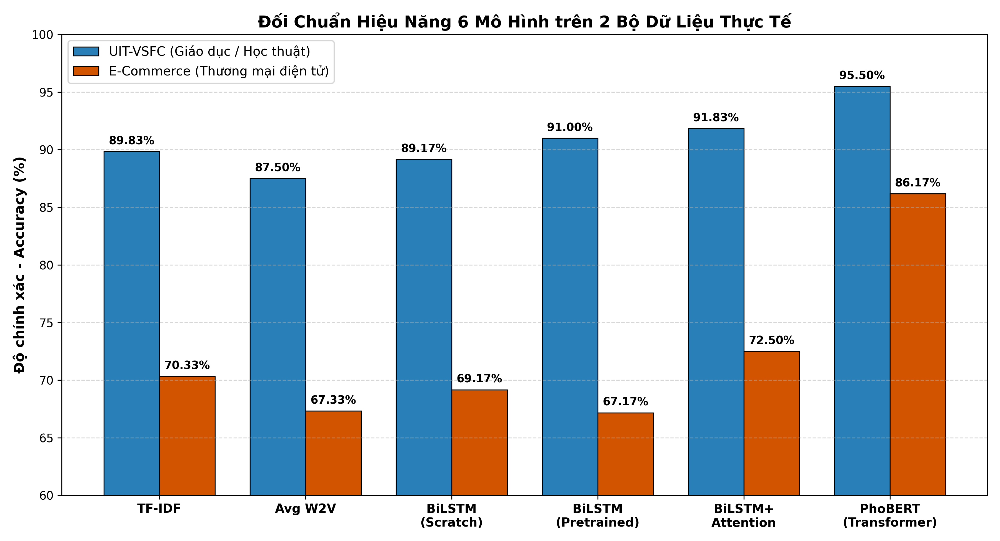
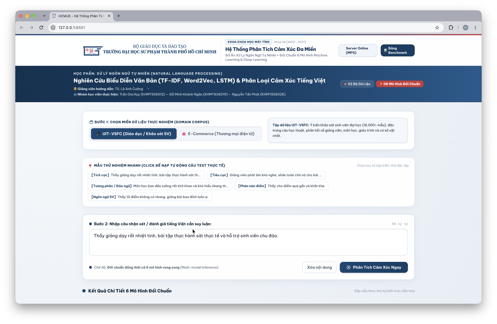

# BÀI TẬP GIỮA KỲ: MÔ HÌNH WORD2VEC, WORD EMBEDDING VÀ HỌC BIỂU DIỄN VĂN BẢN BẰNG LSTM CHO BÀI TOÁN PHÂN LOẠI CẢM XÚC

**Môn học:** Xử lý ngôn ngữ tự nhiên (Natural Language Processing)  
**Đơn vị đào tạo:** Trường Đại học Sư phạm Thành phố Hồ Chí Minh (HCMUE) — Khoa Khoa học Máy tính  
**Lớp:** Cao học Khoa học Máy tính — Khóa 36 (2025 – 2027)  
**Giảng viên hướng dẫn:** **PGS.TS. LÊ ANH CƯỜNG**  

---

### Danh sách nhóm sinh viên thực hiện:
1. **Trần Gia Huy** — MSSV: **KHMT836012**
2. **Đỗ Minh Khánh Ngân** — MSSV: **KHMT836019**
3. **Nguyễn Tấn Phát** — MSSV: **KHMT836026**

**Live Web App & Dashboard:** [https://trangiahuy8444.github.io/NLP/](https://trangiahuy8444.github.io/NLP/)

---

## 📂 CẤU TRÚC THƯ MỤC VÀ TÀI LIỆU DỰ ÁN

```text
Bai_tap_giua_ky/
├── Bao_Cao_Tieu_Luan_Giua_Ky_NLP.pdf   # ⭐ File PDF bài báo cáo tiểu luận hoàn chỉnh chuẩn IEEE/ACM (30 trang)
├── BAO_CAO_GIUA_KY.md                  # 📖 Báo cáo khoa học chi tiết đồng bộ 100% với file PDF
├── Thuc_Hanh_Word2Vec_LSTM.ipynb       # 📓 Jupyter Notebook thực nghiệm trực quan (đã chạy sẵn kết quả)
├── requirements.txt                    # 📋 Danh sách thư viện Python (PyTorch, Transformers, Gensim, Pyvi)
├── run_app.sh                          # 🚀 Script 1-click khởi chạy Web App Demo trên macOS / Linux
├── app.py                              # ⚡ Máy chủ Web App Demo suy luận thời gian thực (Zero Dependency Server)
├── streamlit_app.py                    # 🎈 Ứng dụng Streamlit tương tác nâng cao
├── web_app/                            # 🌐 Giao diện Web SPA chuẩn nhận diện thương hiệu HCMUE
│
├── data/                               # 📂 Dữ liệu thực nghiệm (2 bộ dữ liệu thực tế chuẩn)
│   ├── uit_vsfc/                       # 1. Bộ dữ liệu UIT-VSFC (3,100 mẫu) — Miền học thuật
│   └── ecommerce/                      # 2. Bộ dữ liệu E-Commerce Reviews (3,100 mẫu) — Miền TMĐT
│
├── src/                                # 🛠️ Toàn bộ mã nguồn module hóa
│   ├── preprocess.py                   # Tiền xử lý văn bản tiếng Việt & tách từ
│   ├── word2vec_trainer.py             # Huấn luyện Word2Vec (CBOW & Skip-Gram) bằng Gensim
│   ├── lstm_classifier.py              # Xây dựng & huấn luyện BiLSTM và BiLSTM + Self-Attention
│   ├── phobert_classifier.py           # Fine-tuning mô hình ngôn ngữ lớn tiếng Việt PhoBERT
│   ├── text_representation.py          # Biểu diễn văn bản (TF-IDF, Average Word2Vec, LSTM Vector)
│   ├── evaluate.py                     # Đánh giá Accuracy, F1-Score, Confusion Matrix, Attention Heatmap
│   └── run_experiments.py              # Script chạy toàn bộ pipeline đối chuẩn 6 mô hình
│
├── results/                            # 📊 Kết quả thực nghiệm: Attention Heatmap, t-SNE, CM, đường cong Loss
├── models/                             # 💾 File trọng số mô hình đã lưu (.pt, .model)
├── tai_lieu_tham_khao/                 # 📚 Trọn bộ 12 file PDF bài báo khoa học & sách tham khảo gốc
└── latex_project/                      # 🖋️ Toàn bộ mã nguồn LaTeX và hình ảnh biên dịch ra PDF chính thức
```

---

## 📊 BẢNG TỔNG HỢP ĐỐI CHUẨN 6 MÔ HÌNH TRÊN 2 DATASET THỰC TẾ

Thực nghiệm được thực hiện trên **02 bộ dữ liệu thực tế tiếng Việt độc lập** để đánh giá tính bền vững và khả năng tổng quát hóa đa miền (mỗi tập gồm 600 mẫu kiểm thử Test Set phân bố cân bằng):

| STT | Kiến trúc Mô hình / Phương pháp Biểu diễn | UIT-VSFC Accuracy | UIT-VSFC F1-Score | E-Commerce Accuracy | E-Commerce F1-Score |
|:---:|:---|:---:|:---:|:---:|:---:|
| 1 | **TF-IDF + Logistic Regression (Baseline 1)** | 89.83% | 89.80% | 70.33% | 69.65% |
| 2 | **Average Word2Vec + Logistic Reg. (Baseline 2)** | 87.50% | 87.49% | 67.33% | 66.80% |
| 3 | **BiLSTM Classifier (Học từ đầu - Scratch)** | 89.17% | 89.16% | 69.17% | 68.75% |
| 4 | **BiLSTM (Pre-trained Word2Vec)** | 91.00% | 91.00% | 67.17% | 67.05% |
| 5 | **BiLSTM + Self-Attention (Đề xuất có giải thích XAI)** | **91.83%** | **91.83%** | **72.50%** | **72.40%** |
| 6 | **PhoBERT-base-v2 (Transformer Tiếng Việt SOTA)** | **95.50%** | **95.50%** | **86.17%** | **86.16%** |


*Hình 1: Biểu đồ đối chuẩn hiệu năng giữa 6 mô hình trên 2 bộ dữ liệu thực tế UIT-VSFC và E-Commerce.*

---

## 🔬 BỐN LUẬN ĐIỂM KỸ THUẬT VÀ PHÂN TÍCH HỌC THUẬT CHUYÊN SÂU

### 1. Vì sao Average Word2Vec lại kém hơn cả TF-IDF? (Nghịch lý triệt tiêu phủ định)
Một nghịch lý đáng chú ý là mô hình Word2Vec (vốn được xem là biểu diễn ngữ nghĩa hiện đại hơn) lại cho kết quả **thấp hơn** TF-IDF trên cả hai bộ dữ liệu (87.50% so với 89.83% trên UIT-VSFC; 67.33% so với 70.33% trên E-Commerce). Nguyên nhân cốt lõi nằm ở phép **trung bình cộng (mean pooling)**:
$$\mathbf{v}_D = \frac{1}{|D|} \sum_{w \in D} \mathbf{v}_w$$
- **Mất trật tự từ**: Phép cộng trung bình có tính giao hoán, làm mất hoàn toàn trật tự cú pháp và cấu trúc ngữ pháp.
- **Triệt tiêu sắc thái phủ định**: Từ phủ định *"không"* là hư từ tần suất cao, có vector ở vùng trung tâm không gian. Khi lấy trung bình cộng $\mathbf{v}_{\text{không}}$ với $\mathbf{v}_{\text{tốt}}$, vector của cụm *"không tốt"* chỉ dịch chuyển rất nhỏ khỏi *"tốt"*, hoàn toàn không đủ để vượt qua ranh giới sang lớp Tiêu cực. Nói cách khác, phép trung bình cộng xử lý phủ định như một phép *pha loãng* chứ không phải phép *đảo dấu* ngữ nghĩa.
- **Vì sao TF-IDF tốt hơn**: TF-IDF giữ nguyên từng từ như một chiều đặc trưng tách biệt. Logistic Regression có thể học trực tiếp một hệ số hồi quy âm rất mạnh riêng cho từ *"không"*, giúp nó nhạy bén hơn hẳn với các từ khóa phân cực đơn lẻ.

### 2. Vì sao khởi tạo bằng Word2Vec tiền huấn luyện giúp BiLSTM nâng cao hiệu năng?
Khoảng cách tăng từ 89.17% lên 91.00% (+1.83%) trên UIT-VSFC giữa BiLSTM huấn luyện từ đầu (Scratch) và BiLSTM khởi tạo bằng Word2Vec tiền huấn luyện phản ánh bản chất của học chuyển giao (*transfer learning*):
- Tầng Embedding khởi tạo ngẫu nhiên phải học lại toàn bộ quan hệ từ vựng từ số lượng mẫu ít ỏi của tập train.
- BiLSTM + Pretrained Word2Vec được trang bị sẵn cấu trúc phân bố ngữ nghĩa phong phú, giúp mạng hội tụ nhanh hơn, khái quát hóa tốt hơn trên các từ ít gặp và tránh overfitting.

### 3. Cơ chế Self-Attention đóng góp gì để BiLSTM bứt phá hiệu năng?
So với BiLSTM thuần túy (91.00%), việc bổ sung Self-Attention giúp mô hình tăng lên 91.83% trên UIT-VSFC và đặc biệt **bứt phá tới +5.33% trên E-Commerce** (từ 67.17% lên 72.50%):
- **Giải quyết nghẽn cổ chai thông tin (Information Bottleneck)**: Thay vì nén toàn bộ câu vào trạng thái ẩn cuối cùng $\mathbf{h}_T$, Self-Attention kết hợp tuyến tính có trọng số toàn bộ trạng thái ẩn:
$$\mathbf{v}_D = \sum_{t=1}^T \alpha_t \mathbf{h}_t, \quad \text{với } \alpha_t = \frac{\exp(\mathbf{u}_t^T \mathbf{u}_w)}{\sum_{\tau=1}^T \exp(\mathbf{u}_\tau^T \mathbf{u}_w)}$$
- **Chọn lọc đặc trưng mềm (Soft Feature Selection)**: Trọng số $\alpha_t$ tự động dồn vào các từ mang tính quyết định cảm xúc (như tính từ phân cực, từ phủ định) và hạ thấp trọng số hư từ trung tính.

### 4. Đối chuẩn đa miền: Phân tích mức sụt giảm độ chính xác khi chuyển miền ($\Delta$ Acc)

| Mô hình | UIT-VSFC Acc | E-Com Acc | $\Delta$ Acc (Mức sụt giảm) |
|:---|:---:|:---:|:---:|
| **TF-IDF + LR** | 89.83% | 70.33% | 19.50% |
| **Avg Word2Vec + LR** | 87.50% | 67.33% | 20.17% |
| **BiLSTM (Scratch)** | 89.17% | 69.17% | 20.00% |
| **BiLSTM (Pretrained W2V)** | 91.00% | 67.17% | 23.83% |
| **BiLSTM + Attention** | 91.83% | 72.50% | 19.33% |
| **PhoBERT Base v2** | 95.50% | 86.17% | **9.33% (Nhỏ nhất — Ổn định nhất)** |

- **Đặc thù ngôn ngữ mạng xã hội**: UIT-VSFC là khảo sát học thuật chuẩn mực. E-Commerce chứa vô số teencode (*"sp", "dc", "k", "ship"*), từ lóng, viết tắt, lỗi chính tả và emoji làm bùng nổ tỷ lệ từ ngoài từ điển (OOV).
- **Hiện tượng mỉa mai / châm biếm (Sarcasm)**: Người dùng dùng từ ngữ tích cực để châm biếm chất lượng kém.
- **Sức mạnh thích ứng của PhoBERT**: PhoBERT sụt giảm ít nhất ($\Delta = 9.33\%$, giữ vững 86.17%) nhờ cơ chế tách từ subword (BPE) và biểu diễn ngữ cảnh động sâu sắc.

---

## 🔍 PHÂN TÍCH LỖI ĐỊNH TÍNH (QUALITATIVE ERROR ANALYSIS)

Nhóm tiến hành mổ xẻ 3 trường hợp lỗi thực tế điển hình:
1. **Phủ định kép và chuyển hướng ngữ nghĩa**:
   - *Ví dụ*: *"Giao hàng hơi lâu nhưng chất lượng áo thì đỉnh chóp."*
   - *Thực tế*: **Tích cực** | *Mô hình dự đoán*: **Tiêu cực / Trung tính**.
   - *Nguyên nhân*: Mô hình bị chi phối bởi cụm âm *"hơi lâu"* ở đầu câu và chưa học được liên từ *"nhưng"* có vai trò hạ thấp vế trước và khuếch đại vế sau. Cụm từ lóng *"đỉnh chóp"* bị OOV làm mất tín hiệu dương mạnh nhất.
2. **Ngôn ngữ mỉa mai / châm biếm (Sarcasm)**:
   - *Ví dụ*: *"Shop phục vụ quá nhiệt tình, nhắn tin 3 ngày mới thèm rep."*
   - *Thực tế*: **Tiêu cực** | *Mô hình dự đoán*: **Tích cực**.
   - *Nguyên nhân*: Thiếu cơ chế suy luận thực dụng học (*pragmatic reasoning*). Cả BiLSTM và PhoBERT chỉ bắt tương quan từ vựng bề mặt và gán trọng số rất cao cho cụm từ khen ngợi *"quá nhiệt tình"*.
3. **Từ lóng và teencode ngoài từ điển (OOV)**:
   - *Ví dụ*: *"Đồ mặc nhìn phèn thật sự"* (*phèn* $\to$ Tiêu cực) hoặc *"cháy phố"* ($\to$ Tích cực).
   - *Thực tế*: Rõ cực tính | *Mô hình dự đoán*: **Trung tính / Độ tự tin thấp**.
   - *Nguyên nhân*: Từ lóng mạng xã hội không có trong từ điển tĩnh của TF-IDF/Word2Vec. PhoBERT xử lý tốt hơn nhờ subword nhưng vẫn bị ảnh hưởng nhẹ do dữ liệu tiền huấn luyện là báo chí/Wikipedia chuẩn mực.

### Bảng tổng hợp nguyên nhân lỗi:
| Trường hợp | Nguyên nhân chính | Mô hình chịu ảnh hưởng nhiều nhất |
|:---|:---|:---|
| **Phủ định / Chuyển hướng** | Ngữ cảnh chưa học quy luật liên từ tương phản + OOV cộng hưởng | BiLSTM (Scratch), BiLSTM + Attention |
| **Mỉa mai / Châm biếm** | Thiếu cơ chế lập luận thực dụng, chỉ học tương quan từ vựng bề mặt | Toàn bộ 6 mô hình (kể cả PhoBERT) |
| **Từ lóng / Teencode (OOV)** | Từ ngoài từ điển huấn luyện hoặc corpus tĩnh | TF-IDF, Avg Word2Vec, BiLSTM (Scratch) |

---

## 🚀 THIẾT KẾ VÀ TRIỂN KHAI HỆ THỐNG THỬ NGHIỆM THỜI GIAN THỰC (DEMO WEB APP)

Nhằm thu hẹp khoảng cách giữa nghiên cứu học thuật và ứng dụng thực tiễn, nhóm đã xây dựng hoàn chỉnh hệ thống Web Demo tương tác thời gian thực:

### 1. Kiến trúc luồng dữ liệu 4 bước
1. **Thu nhận đầu vào**: Người dùng nhập văn bản tiếng Việt tự do hoặc lựa chọn mẫu câu thử nghiệm.
2. **Tiền xử lý & Chọn mô hình**: Chuẩn hóa, tách từ bằng `Pyvi`, lựa chọn các mô hình đã huấn luyện.
3. **Suy luận thời gian thực**: Tải trọng số từ checkpoint, tính toán phân phối xác suất và độ trễ mili-giây.
4. **Trực quan hóa kết quả**: Hiển thị bảng đối chuẩn song song và trích xuất ma trận Attention.

### 2. Tính năng Explainable AI (XAI) qua Attention Heatmap
Khi lựa chọn mô hình **BiLSTM + Self-Attention**, hệ thống trích xuất trực tiếp ma trận trọng số $\boldsymbol{\alpha}$ từ tầng attention và tô màu trực tiếp lên từng từ trong câu theo cường độ đóng góp, biến mạng nơ-ron từ một "hộp đen" thành một quy trình suy luận minh bạch.


*Hình 5.1: Kiến trúc hệ thống và giao diện tổng quan của ứng dụng Demo thời gian thực.*


*Hình 5.2: Bản đồ nhiệt Attention Heatmap minh họa quá trình suy luận và giải thích quyết định thời gian thực.*

### 3. Tính khả chuyển & Khả năng tái lập (Deployability & Reproducibility)
- **Đóng gói Docker**: Đóng gói toàn bộ runtime, CUDA/CPU dependencies trong `Dockerfile` và `docker-compose.yml`, loại bỏ hoàn toàn lỗi môi trường.
- **Khởi chạy 1-Click (`run_app.sh`)**: Tự động kích hoạt môi trường Conda/Pip và khởi chạy web server chỉ với một lệnh.
- **GitHub Pages Dashboard**: Phân phối giao diện báo cáo tương tác trực tuyến tại [https://trangiahuy8444.github.io/NLP/](https://trangiahuy8444.github.io/NLP/).

---

## 💻 HƯỚNG DẪN CHẠY & TRẢI NGHIỆM SẢN PHẨM THỰC TẾ

### 1. Khởi chạy Ứng Dụng Web Trực Quan 1-Click (Khuyên dùng)
Hệ thống tích hợp sẵn máy chủ web nhẹ, chạy trực tiếp với Python và PyTorch mà **không cần cài thêm bất kỳ thư viện web phụ thuộc nào khác**:
```bash
# Cách 1: Chạy 1-click bằng bash script (tự động phát hiện môi trường & mở trình duyệt)
./run_app.sh

# Cách 2: Chạy trực tiếp qua Python
python app.py
```
👉 Sau đó truy cập trình duyệt web tại: **`http://localhost:8501`**

### 2. Khởi chạy bằng Streamlit (Tùy chọn)
Nếu bạn có cài đặt thư viện `streamlit`:
```bash
streamlit run streamlit_app.py
```

### 3. Mở Jupyter Notebook để xem chi tiết
```bash
jupyter notebook Thuc_Hanh_Word2Vec_LSTM.ipynb
```

### 4. Chạy lại toàn bộ pipeline huấn luyện đối chuẩn 6 mô hình bằng dòng lệnh
```bash
python src/run_experiments.py
```
*(Tự động chạy huấn luyện/kiểm thử trên cả 2 dataset và xuất đồ thị t-SNE, Confusion Matrix vào thư mục `results/`)*.

---

## ⚖️ GIẤY PHÉP & BẢN QUYỀN
Dự án được thực hiện phục vụ mục đích học thuật và nghiên cứu trong khuôn khổ môn học **Xử lý ngôn ngữ tự nhiên** tại **Trường Đại học Sư phạm TP. Hồ Chí Minh (HCMUE)**.
