# 🎓 HỌC PHẦN: XỬ LÝ NGÔN NGỮ TỰ NHIÊN (NATURAL LANGUAGE PROCESSING)
### TRƯỜNG ĐẠI HỌC SƯ PHẠM THÀNH PHỐ HỒ CHÍ MINH (HCMUE) — KHOA KHOA HỌC MÁY TÍNH
**Lớp:** Cao học Khoa học Máy tính — Khóa 36 (2025 – 2027)  
**Giảng viên hướng dẫn:** **TS. LÊ ANH CƯỜNG**  

**Nhóm học viên thực hiện (Nhóm 3 thành viên):**  
1. **Trần Gia Huy** — MSSV: **KHMT836012**  
2. **Đỗ Minh Khánh Ngân** — MSSV: **KHMT836019**  
3. **Nguyễn Tấn Phát** — MSSV: **KHMT836026**  

---

## 🌐 LIVE INTERACTIVE DASHBOARD & DEMO STUDIO
👉 **Trang báo cáo & Dashboard trực quan hóa tương tác:**  
🔗 **[https://trangiahuy8444.github.io/NLP/](https://trangiahuy8444.github.io/NLP/)**

*(Bao gồm nhận diện thương hiệu HCMUE, đối chuẩn tương tác 6 mô hình, biểu đồ t-SNE 2D không gian ngữ nghĩa, ma trận nhầm lẫn Confusion Matrix, đường cong học Loss/Acc và bản đồ nhiệt Attention Heatmap giải thích từ khóa theo thời gian thực).*

---

## 📂 TỔ CHỨC CẤU TRÚC REPOSITORY

```text
NLP/
├── README.md                           # 📖 Hướng dẫn tổng quan toàn bộ repository và báo cáo nghiên cứu
├── requirements.txt                    # 📋 Danh mục thư viện Python (PyTorch, Transformers, Gensim, Pyvi)
├── run_web.sh                          # 🚀 Script khởi chạy Web Demo từ thư mục gốc
├── .gitignore                          # 🛡️ Cấu hình lọc file rác, file nhị phân lớn >100MB
│
├── Goi_Bao_Cao_Gui_Nhom_NLP/           # 👥 GÓI TÀI LIỆU GỬI NHÓM (PDF báo cáo, Web Demo, Notebook, Data)
│   ├── Bao_Cao_Tieu_Luan_Giua_Ky_NLP.pdf # 📄 Báo cáo tiểu luận hoàn chỉnh 29 trang (chuẩn in ấn & nộp bài)
│   ├── BAO_CAO_GIUA_KY.md              # 📝 Báo cáo Markdown song song
│   ├── Thuc_Hanh_Word2Vec_LSTM.ipynb   # 📓 Jupyter Notebook chạy sẵn 100% kết quả, biểu đồ t-SNE & summary
│   ├── HUONG_DAN_SETUP_CHO_NHOM.md     # 🚀 Hướng dẫn chạy 1-click & setup chi tiết cho thành viên
│   ├── web_app/ & app.py               # 🌐 Hệ thống Web Demo sản phẩm nhận diện thương hiệu HCMUE
│   ├── run_app.sh & run_app.bat        # ⚡ Script 1-click mở Web trên Windows và macOS/Linux
│   ├── data/                           # 📂 02 bộ dữ liệu thực tế chuẩn hóa (UIT-VSFC & E-Commerce)
│   └── models/ & src/                  # 🧠 Trọng số nhẹ và mã nguồn thuật toán đầy đủ
│
├── Goi_Bao_Cao_Gui_Nhom_NLP.zip        # 📦 File nén gói gửi nhóm siêu gọn nhẹ (~23MB, gửi qua Zalo/Email/LMS)
├── Bao_Cao_Nhom_Giua_Ky_NLP.zip        # 📦 Gói nộp bài đồ án đầy đủ (~40MB, phù hợp giới hạn upload trường)
│
├── docs/                               # 🌐 Website GitHub Pages trực quan hóa kết quả (Live Interactive Dashboard)
│   ├── index.html                      # Giao diện chính tích hợp logo & nhận diện thương hiệu HCMUE
│   ├── assets/                         # Logo trường ĐHSP, biểu trưng khoa học
│   └── results/                        # Dữ liệu hình ảnh t-SNE, Attention Heatmap, Demo UI
│
├── Bai_tap_giua_ky/                    # 🎓 ĐỒ ÁN TIỂU LUẬN GIỮA KỲ (Nội dung trọng tâm)
│   ├── Bao_Cao_Tieu_Luan_Giua_Ky_NLP.pdf # ⭐ Bài báo cáo tiểu luận chuẩn IEEE/ACM (30 trang, clickable TOC)
│   ├── BAO_CAO_GIUA_KY.md              # 📖 Báo cáo khoa học chi tiết đồng bộ 100% với file PDF
│   ├── Thuc_Hanh_Word2Vec_LSTM.ipynb   # 📓 Jupyter Notebook thực nghiệm tương tác chạy sẵn kết quả
│   ├── app.py                          # ⚡ Máy chủ Web App Demo suy luận thời gian thực (Zero Dependency Server)
│   ├── streamlit_app.py                # 🎈 Giao diện Streamlit tương tác nâng cao
│   ├── run_app.sh                      # 🚀 Kịch bản 1-click khởi chạy Web App trên macOS/Linux
│   ├── web_app/                        # 🌐 Giao diện Web SPA chuẩn nhận diện thương hiệu HCMUE
│   ├── src/                            # 🛠️ Toàn bộ mã nguồn module hóa (Preprocess, BiLSTM, PhoBERT, Evaluator)
│   ├── data/                           # 📂 02 bộ dữ liệu thực tế: UIT-VSFC (3,100 mẫu) & E-Commerce (3,100 mẫu)
│   ├── models/                         # 💾 Trọng số mô hình đã huấn luyện (TF-IDF, Word2Vec, BiLSTM, PhoBERT)
│   ├── results/                        # 📊 Toàn bộ biểu đồ đối chuẩn, Attention Heatmaps, t-SNE, CM
│   ├── tai_lieu_tham_khao/             # 📚 12 bài báo khoa học PDF trích dẫn gốc (Mikolov, Hochreiter, Vaswani, PhoBERT...)
│   └── latex_project/                  # 🖋️ Mã nguồn LaTeX hoàn chỉnh dùng để biên dịch ra file PDF chính thức
│
├── Bai_tap_ve_nha/                     # 📝 Bài tập về nhà: Mô hình ngôn ngữ N-gram
│   ├── BAI_LAM.md                      # Lời giải chi tiết
│   ├── Thuc_hanh_NGram.ipynb           # Notebook thực hành N-gram
│   └── ngram_language_model.py         # Code triển khai N-gram
│
├── IGM_N-gram/                         # 📝 Bài tập thực hành: Mô hình IGM & N-gram
│   └── Bai_ghi_Mo_hinh_ngon_ngu_N-gram.md
│
├── word2V/                             # 📝 Bài tập thực hành: Huấn luyện Word2Vec cơ sở
│   └── main.py
│
└── HCMUE-NhanDienThuongHieu/           # 🏛️ Bộ nhận diện thương hiệu Trường Đại học Sư phạm TP.HCM
```

---

## 📊 BẢNG TỔNG HỢP ĐỐI CHUẨN 6 MÔ HÌNH (BENCHMARK TABLE)

Thực nghiệm được đánh giá độc lập trên **02 bộ dữ liệu thực tế tiếng Việt độc lập** (mỗi tập gồm 600 mẫu kiểm thử Test Set phân bố cân bằng). Kết quả khớp chính xác 100% từng số thập phân với Báo cáo Tiểu luận Giữa kỳ chính thức:

| STT | Kiến trúc Mô hình | Phương pháp Biểu diễn Văn bản | UIT-VSFC Acc | UIT-VSFC F1 | E-Commerce Acc | E-Commerce F1 | Đánh giá & Phân tích Khoa học |
|:---:|:---|:---|:---:|:---:|:---:|:---:|:---|
| 1 | **TF-IDF + Logistic Regression** | Thống kê n-gram (1,500 dims) | 89.83% | 89.80% | 70.33% | 69.65% | Baseline truyền thống; bắt tốt từ đơn nhưng mất ngữ cảnh |
| 2 | **Average Word2Vec + Logistic Reg.** | Mean Pooling vector từ (100 dims) | 87.50% | 87.49% | 67.33% | 66.80% | Thấp hơn TF-IDF do nghịch lý triệt tiêu phủ định |
| 3 | **BiLSTM Classifier (Huấn luyện từ đầu)** | Trạng thái ẩn cuối chuỗi $\mathbf{h}_T$ (256 dims) | 89.17% | 89.16% | 69.17% | 68.75% | Tự học embedding từ đầu; dễ thiếu biểu diễn với từ hiếm |
| 4 | **BiLSTM (Pre-trained Word2Vec)** | Nạp sẵn Word2Vec + BiLSTM (256 dims) | 91.00% | 91.00% | 67.17% | 67.05% | Tận dụng Transfer Learning, hội tụ nhanh trên miền chuẩn |
| 5 | **BiLSTM + Self-Attention** | *Tổng có trọng số Attention $\mathbf{v}_D$ (256 dims)* | **91.83%** | **91.83%** | **72.50%** | **72.40%** | **Bứt phá +5.33% trên TMĐT, tháo gỡ nút nghẽn cổ chai, XAI** |
| 6 | **PhoBERT Base v2** | *Transformer SOTA (135M params, 768 dims)* | **95.50%** | **95.50%** | **86.17%** | **86.16%** | **Xác lập kỷ lục SOTA, bền bỉ vượt trội trước nhiễu ngôn ngữ** |


*Hình 1: Biểu đồ đối chuẩn hiệu năng đa miền giữa 6 mô hình trên UIT-VSFC và E-Commerce Reviews.*

---

## 🔬 PHÂN TÍCH HỌC THUẬT VÀ 4 LUẬN ĐIỂM KỸ THUẬT CHUYÊN SÂU

### 1. Vì sao Average Word2Vec lại kém hơn cả TF-IDF? (Nghịch lý triệt tiêu phủ định)
Mặc dù Word2Vec là không gian biểu diễn ngữ nghĩa liên tục dày đặc hiện đại, mô hình Average Word2Vec lại đạt kết quả thấp hơn TF-IDF trên cả hai tập dữ liệu (87.50% vs 89.83% trên UIT-VSFC; 67.33% vs 70.33% trên E-Commerce). Nguyên nhân nằm ở phép **trung bình cộng (mean pooling)**:
$$\mathbf{v}_D = \frac{1}{|D|} \sum_{w \in D} \mathbf{v}_w$$
- **Mất trật tự từ tính giao hoán**: Hai câu có thứ tự từ đối lập như *"thầy dạy không khó hiểu"* và *"thầy dạy khó hiểu không"* cho ra cùng một vector giống hệt nhau.
- **Triệt tiêu phủ định (Pha loãng thay vì đảo chiều)**: Từ phủ định *"không"* là hư từ tần suất cao xuất hiện ở mọi ngữ cảnh, vector của nó nằm ở vùng trung tâm không gian. Khi lấy trung bình $\mathbf{v}_{\text{không}}$ với $\mathbf{v}_{\text{tốt}}$, vector cụm *"không tốt"* chỉ dịch chuyển rất nhỏ so với *"tốt"*, hoàn toàn không đủ để vượt qua siêu phẳng phân chia sang lớp Tiêu cực.
- **Lý do TF-IDF tốt hơn**: TF-IDF giữ mỗi từ thành một chiều độc lập, cho phép Logistic Regression học trọng số âm rất lớn riêng cho token *"không"*, giúp nó bắt nhạy các từ phủ định cục bộ.

### 2. Lợi ích Transfer Learning của Word2Vec tiền huấn luyện cho BiLSTM
Khoảng cách tăng từ 89.17% lên 91.00% (+1.83%) trên UIT-VSFC giữa BiLSTM huấn luyện từ đầu (Scratch) và BiLSTM nạp sẵn Word2Vec phản ánh bản chất của học chuyển giao:
- BiLSTM Scratch khởi tạo ngẫu nhiên phải học toàn bộ biểu diễn từ vựng chỉ từ 2,500 mẫu train, dẫn đến từ hiếm không thể hội tụ.
- BiLSTM + Pretrained Word2Vec được trang bị sẵn cấu trúc phân bố ngữ nghĩa phong phú học từ kho ngữ liệu không giám sát quy mô lớn, giúp mô hình tập trung học sự kết hợp chuỗi và giảm thiểu tối đa hiện tượng quá khớp (overfitting).

### 3. Cơ chế Self-Attention tháo gỡ điểm nghẽn cổ chai thông tin
Việc bổ sung cơ chế Additive Self-Attention giúp BiLSTM tăng từ 91.00% lên 91.83% trên UIT-VSFC và đặc biệt **bứt phá ngoạn mục từ 67.17% lên 72.50% (+5.33%) trên E-Commerce**:
- **Giải quyết nghẽn cổ chai thông tin (Information Bottleneck)**: Thay vì nén toàn bộ câu vào vector bước cuối cùng $\mathbf{h}_T$, Attention tính tổng có trọng số trên toàn chuỗi trạng thái ẩn:
$$\mathbf{v}_D = \sum_{t=1}^T \alpha_t \mathbf{h}_t, \quad \text{với } \alpha_t = \frac{\exp(\mathbf{u}_t^T \mathbf{u}_w)}{\sum_{\tau=1}^T \exp(\mathbf{u}_\tau^T \mathbf{u}_w)}$$
- **Chọn lọc đặc trưng mềm (Soft Feature Selection)**: Mô hình tự động hạ thấp trọng số hư từ và dồn trọng số lớn vào cụm từ cảm xúc quyết định ở vế sau của các câu tương phản (ví dụ: *"Giao hàng nhanh nhưng đồ quá xấu"* $\to$ Attention dồn vào *"quá xấu"*).

### 4. Đối chuẩn đa miền: Phân tích mức sụt giảm độ chính xác khi chuyển miền ($\Delta$ Acc)

| Mô hình / Kiến trúc | UIT-VSFC Accuracy | E-Commerce Accuracy | $\Delta$ Acc (Mức sụt giảm) | Đánh giá tính ổn định |
|:---|:---:|:---:|:---:|:---|
| **TF-IDF + LR** | 89.83% | 70.33% | 19.50% | Sụt giảm mạnh do OOV từ vựng |
| **Avg Word2Vec + LR** | 87.50% | 67.33% | 20.17% | Kém ổn định, chịu tác động kép OOV + triệt tiêu phủ định |
| **BiLSTM (Scratch)** | 89.17% | 69.17% | 20.00% | Giảm mạnh do nhiễu teencode |
| **BiLSTM (Pretrained W2V)** | 91.00% | 67.17% | 23.83% | Giảm mạnh nhất do lệch miền từ vựng (Domain Shift) |
| **BiLSTM + Attention** | 91.83% | 72.50% | 19.33% | Kháng nhiễu tốt hơn BiLSTM thuần túy |
| **PhoBERT Base v2** | 95.50% | 86.17% | **9.33% (Nhỏ nhất)** | **Bền vững nhất, vượt trội áp đảo trước ngôn ngữ mạng** |

- **Giải mã nguyên nhân PhoBERT bền bỉ nhất**: Nhờ cơ chế tách từ subword BPE (hạn chế tối đa OOV) cùng 12 tầng Transformer Encoder nắm bắt ngữ cảnh hai chiều sâu sắc, PhoBERT duy trì độ chính xác cao 86.17% trên E-Commerce và có mức sụt giảm $\Delta \text{Acc}$ chỉ **9.33%** (thấp hơn phân nửa so với các mô hình còn lại).

---

## 🔍 PHÂN TÍCH LỖI ĐỊNH TÍNH (QUALITATIVE ERROR ANALYSIS)

Khảo sát chuyên sâu 3 trường hợp lỗi thực tế điển hình trên các kiến trúc:

```mermaid
flowchart TD
    subgraph Case1["Ca 1: Câu tương phản đảo hướng"]
        c1["Giao hàng hơi lâu nhưng chất lượng áo thì đỉnh chóp"] --> gt1["Thực tế: TÍCH CỰC"]
        c1 --> pred1["Dự đoán sai: TIÊU CỰC"]
        pred1 -.-> r1["Nguyên nhân: Cụm âm đầu câu chi phối, từ lóng 'đỉnh chóp' bị OOV"]
    end

    subgraph Case2["Ca 2: Ngôn ngữ mỉa mai / Sarcasm"]
        c2["Shop phục vụ quá nhiệt tình, nhắn tin 3 ngày mới thèm rep"] --> gt2["Thực tế: TIÊU CỰC"]
        c2 --> pred2["Dự đoán sai: TÍCH CỰC (Cả PhoBERT)"]
        pred2 -.-> r2["Nguyên nhân: Thiếu suy luận thực dụng; Attention bị bẫy bởi từ 'nhiệt tình'"]
    end

    subgraph Case3["Ca 3: Từ lóng / Teencode mới OOV"]
        c3["Đồ mặc nhìn phèn thật sự / Outfit cháy phố"] --> gt3["Thực tế: Rõ cực tính"]
        c3 --> pred3["Dự đoán sai: TRUNG TÍNH (Conf thấp)"]
        pred3 -.-> r3["Nguyên nhân: Lệch phân bố với ngữ liệu báo chí chính thống"]
    end
```



### Bảng tổng hợp ba nhóm nguyên nhân lỗi điển hình:
| Trường hợp lỗi | Bản chất nguyên nhân kỹ thuật | Mô hình chịu ảnh hưởng nhiều nhất |
|:---|:---|:---|
| **Cấu trúc tương phản / Phủ định kép** | Cửa sổ ngữ cảnh chưa học đủ trọng số liên từ đảo ngữ + OOV làm mất tín hiệu vế sau | BiLSTM (Scratch), BiLSTM + Attention |
| **Mỉa mai / Châm biếm (Sarcasm)** | Thiếu cơ chế suy luận thực dụng học (*pragmatic reasoning*) và tri thức đời thực | **Toàn bộ 6 mô hình** (kể cả PhoBERT) |
| **Từ lóng / Teencode mạng (OOV)** | Từ mới không có trong từ điển tĩnh hoặc lệch phân bố với ngữ liệu tiền huấn luyện | TF-IDF, Avg Word2Vec, BiLSTM Scratch |

---

## 🚀 THIẾT KẾ VÀ TRIỂN KHAI DEMO WEB APP (EXPLAINABLE AI)

Hệ thống được chuyển giao thành sản phẩm Web Application hoàn chỉnh với 4 đặc trưng:

### 1. Luồng dữ liệu 4 bước khép kín (End-to-End Architecture)
1. **Thu nhận đầu vào**: Người dùng nhập văn bản tiếng Việt tự do hoặc chọn câu mẫu.
2. **Tiền xử lý & Chọn mô hình**: Chuẩn hóa tiếng Việt, tách từ bằng `Pyvi`, sinh tensors.
3. **Suy luận thời gian thực**: Nạp checkpoints, suy luận phân phối xác suất và độ trễ mili-giây.
4. **Trực quan hóa kết quả**: Hiển thị bảng đối chuẩn song song 6 mô hình và Attention Heatmap.

### 2. Tính năng Explainable AI (XAI) qua Attention Heatmap
Trích xuất trực tiếp trọng số chú ý $\alpha_t$ của mô hình **BiLSTM + Self-Attention** và tô màu theo cường độ:
- Màu đỏ đậm thể hiện trọng số cao ($\alpha_t \in [0.25, 0.45]$) đối với các từ khóa cảm xúc cốt lõi.
- Màu nhạt thể hiện các hư từ hoặc từ thực thể ít liên quan.
- Giúp người dùng kiểm chứng tính khoa học trong quyết định phân loại của mô hình.

### 3. Giao diện trực quan tích hợp hình ảnh thực tế


*Hình 5.1: Kiến trúc hệ thống và tổng quan giao diện ứng dụng Demo thử nghiệm phân loại cảm xúc thời gian thực (Mang chuẩn bộ nhận diện thương hiệu HCMUE).*


*Hình 5.2: Bản đồ nhiệt Attention Heatmap minh họa quá trình suy luận và giải thích quyết định thời gian thực trên mẫu câu đánh giá.*

### 4. Tính khả chuyển & Khả năng tái lập (Deployability & Reproducibility)
- **Đóng gói Docker**: Khởi chạy dễ dàng, độc lập nền tảng, loại bỏ lỗi xung đột môi trường.
- **Kịch bản 1-Click (`run_app.sh`)**: Tự động phát hiện môi trường và khởi động máy chủ tức thì.
- **GitHub Pages**: Trang dashboard tương tác trực tuyến tại [https://trangiahuy8444.github.io/NLP/](https://trangiahuy8444.github.io/NLP/).

---

## 💻 HƯỚNG DẪN CHẠY MÃ NGUỒN TẠI LOCAL

### 1. Cài đặt môi trường
```bash
conda activate ML
# Hoặc cài đặt các phụ thuộc:
pip install -r requirements.txt
```

### 2. Khởi chạy Ứng Dụng Web Trực Quan 1-Click
```bash
cd Bai_tap_giua_ky
./run_app.sh
# Hoặc: python app.py
```
👉 Truy cập trình duyệt web tại: **`http://localhost:8501`**

### 3. Khởi chạy Jupyter Notebook nghiên cứu
```bash
cd Bai_tap_giua_ky
jupyter notebook Thuc_Hanh_Word2Vec_LSTM.ipynb
```

### 4. Tái lập toàn bộ pipeline huấn luyện đối chuẩn 6 mô hình
```bash
cd Bai_tap_giua_ky
python src/run_experiments.py
```

---

## ⚖️ BẢN QUYỀN VÀ TRÍCH DẪN
Dự án được nghiên cứu và phát triển trong khuôn khổ môn học **Xử lý ngôn ngữ tự nhiên** tại **Trường Đại học Sư phạm Thành phố Hồ Chí Minh (HCMUE)**. Mã nguồn và dữ liệu phục vụ mục đích nghiên cứu học thuật phi thương mại.
